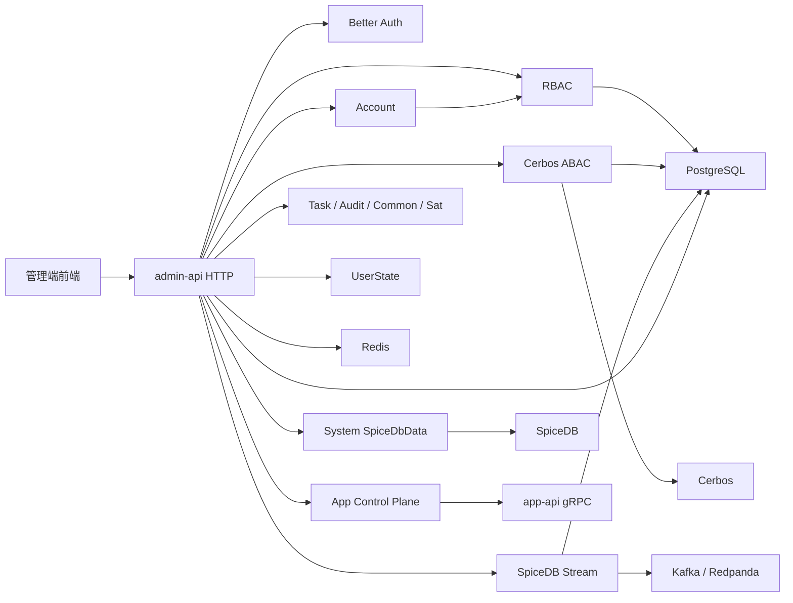
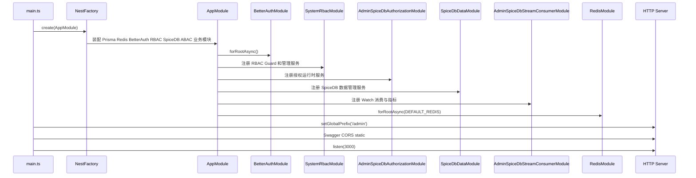
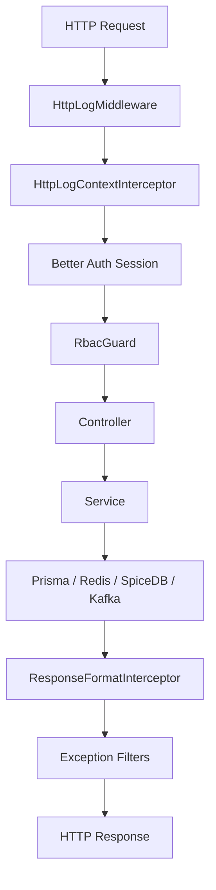
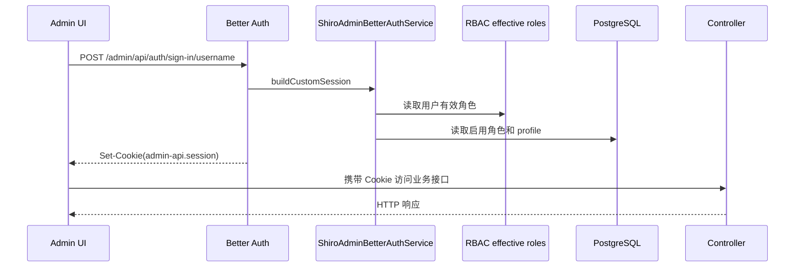
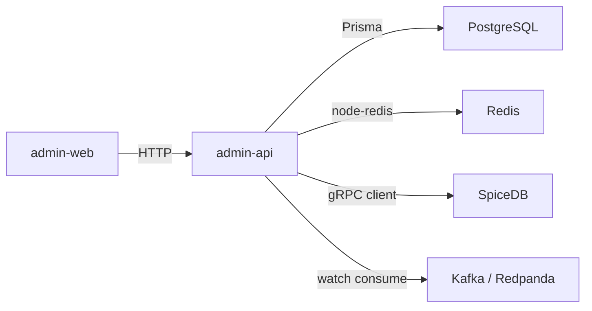
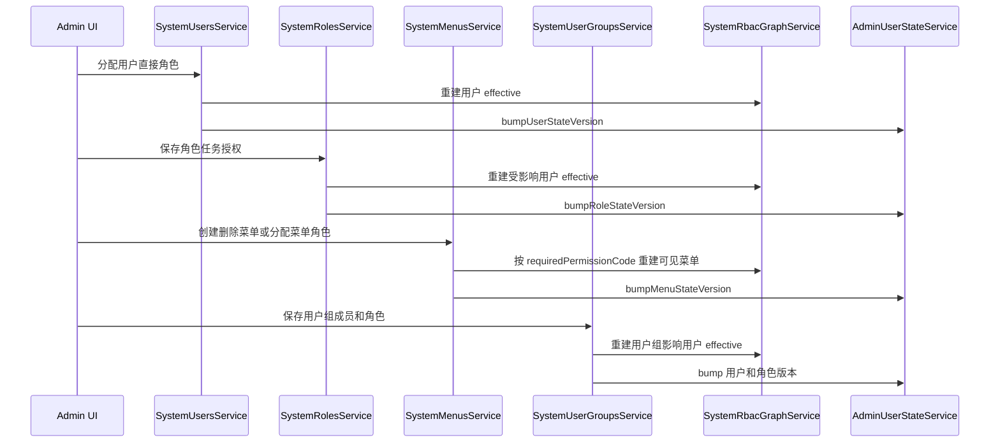

# admin-api 架构总图

## 1. 建模说明

- 图只覆盖当前仓库里已接线的后台链路。
- 核心能力是 Better Auth cookie session、RBAC effective 读模型、PostgreSQL 元数据、Redis 缓存与用户状态版本、SpiceDB 显式关系、Cerbos ABAC，以及 Kafka Watch 投影同步。
- `system/spicedb-data` 是数据管理和排障入口；用户、角色、菜单、用户组的基础授权写入走 RBAC Service。

## 2. 应用模块总览图

## 3. Bootstrap 时序图

## 4. 请求处理链路图

## 5. 认证与权限能力链路图

## 6. 数据与基础设施拓扑图

## 7. 权限关系写入图

