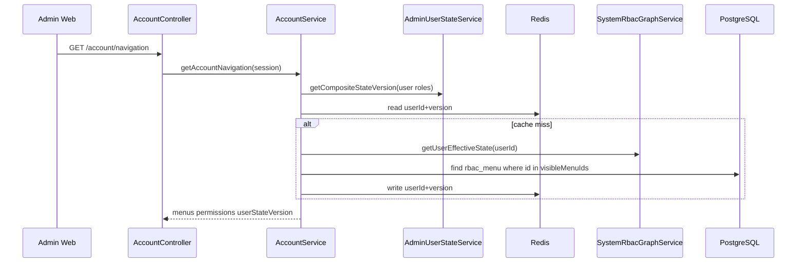

# Account 模块 RBAC 导航与权限说明

## 范围

- `apps/admin-api/src/modules/account/account.controller.ts`
- `apps/admin-api/src/modules/account/account.service.ts`
- `apps/admin-api/src/modules/better-auth/better-auth.service.ts`
- `apps/admin-api/src/modules/system/rbac/rbac-authorization.service.ts`
- `apps/admin-api/src/modules/system/rbac/rbac-graph.service.ts`

## 一句话总览

`AccountService` 从 Better Auth session 取得当前用户 ID，读取 `SystemRbacGraphService.getUserEffectiveState(userId)` 得到可见菜单 ID 和权限 code，再回 `rbac_menu` 取菜单元数据；导航接口直接返回 effective 权限 code，批量按钮态检查使用 granted code set 做集合判断。

## 接口清单

| 方法   | 路径                               | 作用                                       |
| ------ | ---------------------------------- | ------------------------------------------ |
| `GET`  | `/account/navigation`              | 返回当前用户菜单、权限 code 和综合状态版本 |
| `GET`  | `/account/info`                    | 返回账户资料、角色编码和权限 code          |
| `POST` | `/account/permissions/check-batch` | 按 RBAC 权限 code 批量检查当前用户是否拥有 |

## 导航流程

## 数据来源

- 身份：`session.user.id`。
- 角色：Better Auth custom session 中的 `session.roles`，来源为 `rbac_effective_user_role -> rbac_role`。
- 可见菜单：`rbac_user_visible_menu`。
- 菜单元数据：`rbac_menu`。
- 权限列表：RBAC effective permission code set。

`/account/navigation` 的菜单来源是 `rbac_user_visible_menu` 与 `rbac_menu`。

## 批量权限检查

`/account/permissions/check-batch` 只按 RBAC 权限 code 判断：

1. 请求 code 去重后一次查询 `rbac_permission`，得到存在性和启用状态。
2. code 不存在返回 `permission_not_found`。
3. code 禁用返回 `permission_disabled`。
4. 只要存在启用 code，就调用 `RbacAuthorizationService.getGrantedCodes(session.user.id)` 读取用户 effective code set。
5. 命中返回 `rbac_allowed`，否则返回 `rbac_denied`。

这里先批量读取配置状态，再用 granted code set 做集合判断，用来返回 `permissionId`、`permissionStatus`、`reason` 字段并复用同一份权限配置读取结果。

## 回归点

- 用户没有可见菜单时，`menus` 返回空数组，`permissions` 仍按 RBAC effective code 返回。
- 禁用菜单不会进入 `menus`。
- Button 类型不进入 `menus`，但对应 code 可进入 `permissions`。
- 综合状态版本变更后，导航缓存 key 改变，前端会重新拉菜单和权限。

