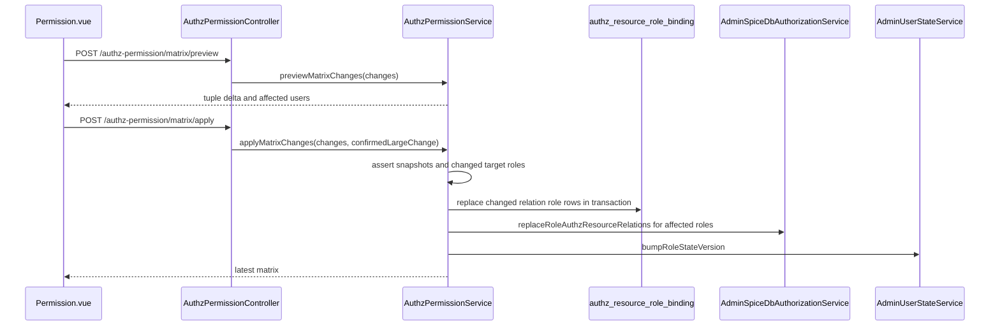

# Authz Permission 模块说明

## 1. 模块定位

`AuthzPermissionModule` 是后台日常权限授权入口。它展示当前 SpiceDB schema 探测到的实体权限，并只允许把核心 manager relation 分配给角色。

本模块不管理菜单 Page/Catalog 入口，不新增投影表，不解析 `spicedb/schema.zed` 原文；schema 展示复用 `SpiceDbDataService.getSchema()` 的 definition 结果。

## 2. 依据代码

- `apps/admin-api/src/modules/authz-permission/authz-permission.controller.ts`
- `apps/admin-api/src/modules/authz-permission/authz-permission.service.ts`
- `apps/admin-api/src/modules/authz-permission/dto/authz-permission.dto.ts`
- `apps/admin-api/src/modules/spicedb/core-manager-authz.constants.ts`
- `apps/admin-api/src/modules/spicedb/admin-spicedb-authorization.service.ts`
- `apps/admin-api/src/modules/system/spicedb-data/spicedb-data.service.ts`
- `apps/admin-web/src/api/authz-permission.ts`
- `apps/admin-web/src/views/system/permission/Permission.vue`

## 3. 接口

| 方法   | 路径                                        | 作用                                                                |
| ------ | ------------------------------------------- | ------------------------------------------------------------------- |
| `GET`  | `/authz-permission/matrix`                  | 返回 schema definitions、角色列表、核心 manager relation 和授权状态 |
| `POST` | `/authz-permission/matrix/preview`          | 预览批量矩阵变更的新增/删除 tuple 数、影响角色和影响用户            |
| `POST` | `/authz-permission/matrix/apply`            | 应用批量矩阵变更，大变更必须带二次确认                              |
| `POST` | `/authz-permission/rename-resource`         | 按 SpiceDB 实体名重命名页面展示名                                   |
| `GET`  | `/authz-permission/object-bindings`         | 读取指定核心对象的对象例外授权关系                                  |
| `POST` | `/authz-permission/object-bindings/preview` | 预览对象例外授权变更                                                |
| `POST` | `/authz-permission/object-bindings/apply`   | 应用对象例外授权变更，大变更必须带二次确认                          |

这些接口都使用页面入口 token `system.permission.view`。真正的授权写入校验在 Service 内按目标角色对象权限判断。

## 4. 实体展示名

`authz_resource_metadata` 保存 SpiceDB 实体展示名，`resource_type` 直接使用 schema definition name 作为主键，`display_name` 是前端展示名。`GET /authz-permission/matrix` 会为当前 schema definition 补齐缺失元数据行，初始 `display_name` 等于英文实体名，页面重命名后再按数据库值展示。

## 5. 可写范围

只允许写以下核心 manager：

```text
user_manager
role_manager
menu_manager
user_group_manager
task_manager
```

`authz_resource_role_binding` 是唯一源表：

```text
resourceType = manager 类型
resourceId = relation 名
roleId = 被授权角色 ID
```

其它 schema definition 的 relation 和 permission 只展示表达式，不提供授权控件。

## 6. 写入流程



失败补偿：

- 写 SpiceDB 失败时按本次批量变更恢复源表变更前快照。
- 恢复后按受影响角色写回变更前的完整 manager relation 集合。
- 任一目标角色权限不足时，在写源表前直接失败。
- `createCount + deleteCount > 20` 或 `affectedUserCount > 50` 时，`apply` 必须带 `confirmedLargeChange: true`。

## 7. 授权校验

- 修改非 `task_manager` relation 需要目标角色 `role:<id>#update`。
- 修改 `task_manager.viewer/creator/updater/deleter/runner` 需要目标角色 `role:<id>#assign_task_capability`。
- 修改 `task_manager.manager` 需要目标角色 `role:<id>#assign_task_resource`。
- 批量替换角色集合时，任一发生变化的目标角色不可编辑，整次请求失败。

## 8. 前端页面

`Permission.vue` 有两个视图：

- 按实体：左侧展示 `authz_resource_metadata.display_name`，右侧展示该实体 relation/permission；核心 manager relation 可选择角色并逐行预览后保存，实体展示名可在弹窗里重命名。
- 按角色：左侧是角色，右侧按核心 manager 模块展示 relation checkbox；模块保存和全页保存都会汇总为批量 `changes`，先预览影响再应用。

角色没有对应编辑能力时，选择项和 checkbox 禁用。菜单入口授权仍在菜单页维护。

## 9. 对象例外授权边界

后端对象例外授权具备模型、接口、preview/apply、大批量确认、状态版本刷新和删除清理能力。

权限管理页的矩阵视图覆盖核心 manager relation。对象例外授权是后端和运维侧能力，不属于菜单入口 permission，也不由矩阵视图表达为页面菜单授权。

