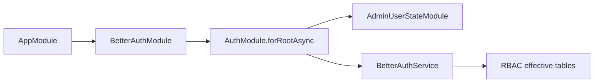
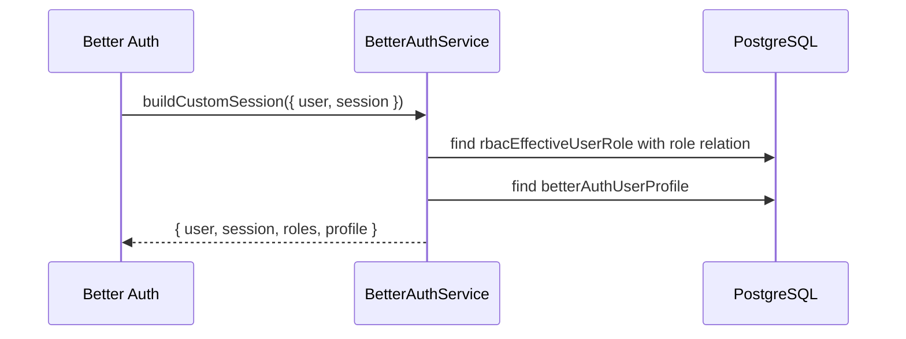

# Better Auth 模块与 RBAC 会话角色说明

## 1. 范围与依据代码

- `apps/admin-api/src/modules/better-auth/better-auth.module.ts`
- `apps/admin-api/src/modules/better-auth/better-auth.service.ts`
- `apps/admin-api/src/modules/better-auth/better-auth-options.ts`
- `apps/admin-api/src/modules/better-auth/better-auth-session.type.ts`
- `apps/admin-api/src/modules/system/rbac/rbac-graph.service.ts`
- `prisma/admin/rbac.prisma`

本文描述 `admin-api` Better Auth 和 RBAC 的边界。

## 2. 一句话总览

Better Auth 负责“你是谁”和 session 生命周期；admin 授权由 `BetterAuthSessionGuard` 认证通过后交给 `RbacGuard` 按 RBAC permission code 判断。`customSession` 只把角色摘要和资料组合成后台请求上下文，不把权限全集塞进 session。

## 3. 模块装配

`BetterAuthModule.forRootAsync()` 当前配置：

- `isGlobal: true`
- `disableGlobalAuthGuard: false`
- 引入 `AdminUserStateModule`
- 通过 `buildBetterAuthOptions()` 构造 Better Auth 配置

## 4. customSession 构建流程

## 5. 会话结构

`BetterAuthSession` 包含：

- `user`：Better Auth 用户主表字段。
- `session`：Better Auth session 字段，唯一标识使用 `session.token`。
- `roles`：一次查询 `rbac_effective_user_role`，通过 `role` relation select 带出的启用角色元数据。
- `profile`：`shiro_better_auth_user_profile`。

## 6. 边界与注意事项

- Better Auth 不保存权限全集，也不参与 admin RBAC 判权。
- `BetterAuthSessionGuard` 只负责公开路由放行、可选 session 和受保护路由 session 必须存在。
- Admin 授权入口是 RBAC metadata、`RbacGuard` 和 `RbacAuthorizationService`；Better Auth 负责认证和 session 生命周期。
- `RbacGuard` 从 `request.session.user.id` 或 `request.session.session.userId` 解析当前用户；`request.user` 可由 session resolver 写入给日志或审计使用。
- 用户组继承角色由 `rbac_user_group_role` 重建到 effective 读模型。
- 禁用角色由 `rbac_role.status` 排除。
- 禁用用户组由 `rbac_user_group.status` 排除。

## 7. 回归用例

- 用户直接角色启用时，登录后 `session.roles` 包含该角色。
- 用户组角色启用且用户组启用时，登录后 `session.roles` 包含继承角色。
- 角色禁用后重新登录，`session.roles` 排除该角色。
- 用户组禁用后重新登录，`session.roles` 排除该组继承角色。

