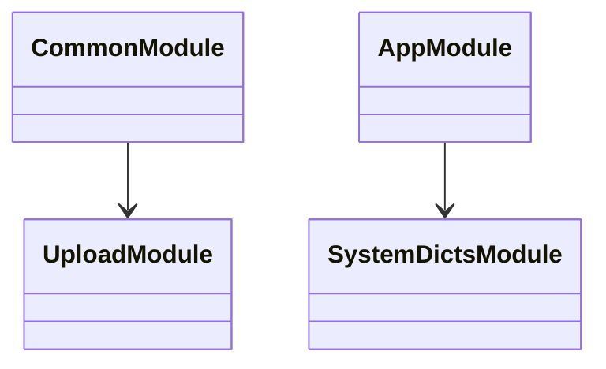
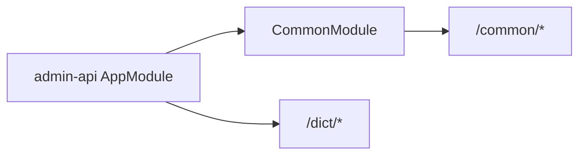
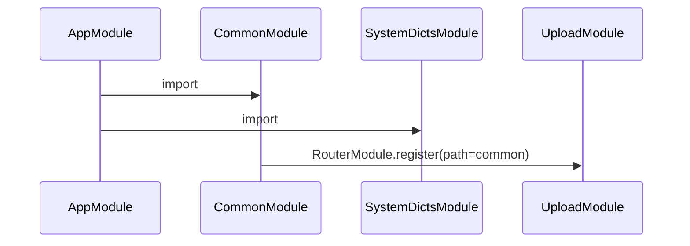

# Common 模块关系图

## 1. 建模说明

`CommonModule` 本身不提供 service，只聚合 `UploadModule`，并用 `RouterModule` 为上传能力挂载 `/common` 路由前缀。字典能力已经归入 `system/dicts`，由 `AppModule` 直接导入。

## 2. 模块分层结论

- `UploadModule` 走 `/common/*`
- `SystemDictsModule` 负责 `/dict/*`
- `CommonModule` 只是通用基础设施装配壳

