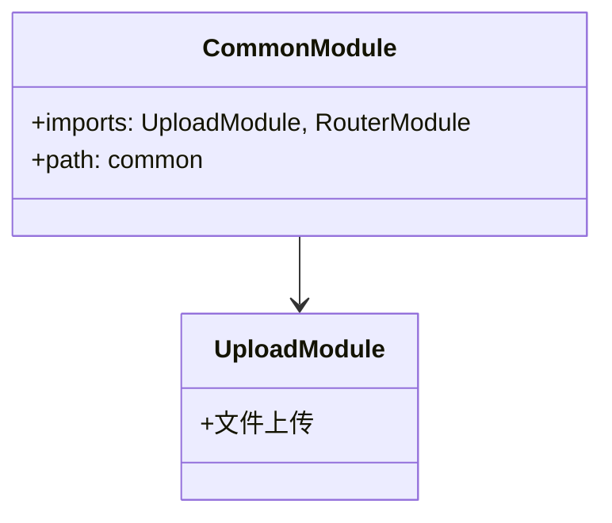

# Common 模块文档（admin-api）

## 1. 模块职责

- 聚合通用基础设施子模块：上传（Upload）
- 通过 RouterModule 将 Upload 挂载到 `/common` 路径下
- 字典（Dict）属于 system 业务能力，由 AppModule 直接导入 `SystemDictsModule`

## 2. 代码清单

- `apps/admin-api/src/modules/common/common.module.ts`
- `apps/admin-api/src/modules/common/upload/upload.module.ts`
- `apps/admin-api/src/modules/system/dicts/dicts.module.ts`

## 3. 类关系图

## 4. 配置要求

- 无

## 5. 注意事项

- 与 app-api 的 Common 模块结构类似
