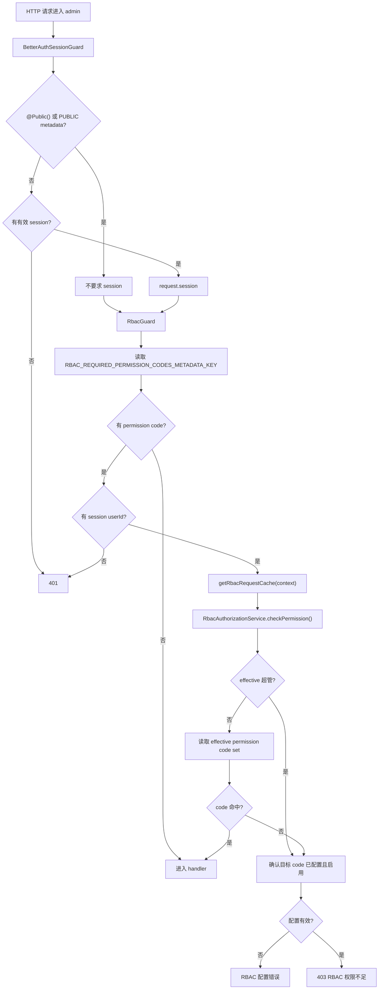

# ShiroAdmin RBAC 权限系统说明

本文说明 `apps/admin-api/src/modules/system/rbac` 当前 RBAC 设计。后台基础接口授权只走本地 RBAC。Guard、AuthorizationService、请求缓存、effective permission cache 基类和图计算位于 `libs/rbac-core`；本模块负责 `rbac_*` Prisma 适配、effective 表写入、错误码和管理接口。

## 1. 核心概念

| 名称                     | 作用                                                               |
| ------------------------ | ------------------------------------------------------------------ |
| `permissionCode`         | 代码装饰器里的稳定权限声明，例如 `system.user.create`。            |
| `code`                   | 数据库权限编码；当前与 `permissionCode` 一致。                     |
| `role`                   | 角色源表，可直接分配给用户，也可分配给用户组。                     |
| `user group`             | 用户组源表，用来批量归集用户并继承角色。                           |
| `permission group`       | 权限分组，只用于后台页面归类，不参与运行时判权。                   |
| `requiredPermissionCode` | 菜单声明的可见性权限 code；菜单不授予权限。                        |
| `effective`              | 读模型，写操作后重建，用于运行时快速读取最终角色、权限、可见菜单。 |

## 1.1 共享 core 与本地适配

| 层                | 代码                                            | 说明                                                                                                           |
| ----------------- | ----------------------------------------------- | -------------------------------------------------------------------------------------------------------------- |
| 共享 runtime      | `libs/rbac-core/src/runtime/*`                  | metadata key、`RbacGuardBase`、`RbacAuthorizationServiceBase`、请求内 cache、effective permission cache base。 |
| 共享 graph engine | `libs/rbac-core/src/graph/rbac-graph.engine.ts` | 角色继承、用户直接角色 + 用户组角色合并、权限集合和可见菜单集合的纯函数计算。                                  |
| admin adapter     | `apps/admin-api/src/modules/system/rbac/*`    | 注入 `rbac_*` Prisma model、`admin-api` cache namespace、错误码、user-state 版本和管理接口。           |

事实来源是 `rbac_*` 源表和 `rbac_effective_*` 读模型；`rbac-core` 不直接访问数据库。metadata key 和 request cache 直接从 `@app/rbac-core` 引入。

## 2. 新手快速路径

新加一个需要 RBAC 保护的后台接口：

1. 在 `rbac-permissions.ts` 的 `RBAC_PERMISSIONS` 中声明稳定 code。
2. 在 controller handler 上写 `@RbacPermission(RBAC_PERMISSIONS.X)`。
3. 如果 service 方法可能被任务、RPC/gRPC、其他 controller 复用，service 内再调用 `RbacAuthorizationService.assertPermission(actorId, RBAC_PERMISSIONS.X)`。
4. 让权限记录进入 `rbac_permission`：通过 RBAC 权限页从后端声明树创建，或加入 seed。
5. 在角色页把该权限分配给目标角色。
6. 如果要显示菜单，在菜单记录上声明 `requiredPermissionCode`。
7. 写操作触发 effective 重建；排查状态漂移时可用 `/rbac/effective/apply-rebuild` 做全量校准。

最容易漏的是第 4 步：代码里写了装饰器不等于权限已落库。运行时会检查目标 code 是否存在、启用、未删除；缺配置时抛 RBAC 配置错误，不是普通 403。

## 3. 完整鉴权链路



职责边界：

- `BetterAuthSessionGuard`：只负责认证和 Better Auth session。
- `RbacGuard`：本地 APP_GUARD 适配器，实际判权流程在 `RbacGuardBase`。
- `RbacAuthorizationService`：本地 DI 入口，实际判断顺序在 `RbacAuthorizationServiceBase`，Prisma 读取由 `AdminRbacAuthorizationStore` 实现。
- `SystemRbacGraphService`：从 RBAC 源表读取数据、调用 `rbac-graph.engine.ts`、重写 effective 读模型。

## 4. 装饰器怎么选

| 场景                                              | 推荐写法                                        | 说明                                                                        |
| ------------------------------------------------- | ----------------------------------------------- | --------------------------------------------------------------------------- |
| 普通 admin HTTP 业务接口                          | `@RbacPermission(RBAC_PERMISSIONS.X)`           | 推荐入口；写运行时权限 code，也进入权限发现树。                             |
| 需要补充候选名称、类型、描述，或一次声明多个 code | `@RbacDeclarePermissions(...)`                  | 底层 RBAC 声明装饰器；同时写候选 metadata 和运行时 metadata。               |
| 完全公开、不需要登录                              | `@Public()`                                     | 只让 Better Auth session guard 不要求 session；不要和 RBAC 权限装饰器混用。 |
| service 内部敏感动作、复用方法、任务、RPC/gRPC    | `assertPermission(actorId, RBAC_PERMISSIONS.X)` | 不依赖路由 metadata，由业务代码显式触发最终断言。                           |

RBAC 当前入口是 `@RbacPermission()`、`@RbacDeclarePermissions()`、`RbacGuard` 和 `RbacAuthorizationService`；新代码使用这些入口。

## 5. Controller 入口权限

```ts
import { RbacPermission } from '../rbac/rbac-permission.decorator';
import { RBAC_PERMISSIONS } from '../rbac/rbac-permissions';

@Post('create')
@RbacPermission(RBAC_PERMISSIONS.SYSTEM_TASK_CREATE)
async createTask() {
    return this.taskService.create();
}
```

说明：

- `RbacPermission` 的入参就是运行时真正检查的 code。
- `RBAC_PERMISSION_CODE_METADATA_KEY` 保存单个 RBAC 主权限点；SpiceDB 不读取这个 metadata。
- `RBAC_REQUIRED_PERMISSION_CODES_METADATA_KEY` 保存运行时要检查的 code 数组，供 `RbacGuard` 读取。
- class 级权限和 handler 级权限会合并去重，默认 all 语义。

一次声明多个权限：

```ts
@RbacDeclarePermissions(
    { permissionCode: 'system.task.read', name: '读取任务', kind: 'ACTION' },
    { permissionCode: 'system.task.publish', name: '发布任务', kind: 'ACTION' }
)
async publishTask() {}
```

## 6. Service 层额外权限检查

Controller 装饰器只保护当前 HTTP 入口。只要 service 方法可能从多个入口进入，或者执行敏感写操作，就应该在 service 内部再做权限断言：

```ts
@Injectable()
export class SystemUsersService {
    constructor(private readonly rbacAuthorizationService: RbacAuthorizationService) {}

    async deleteUser(actorId: string, targetUserId: string) {
        await this.rbacAuthorizationService.assertPermission(actorId, RBAC_PERMISSIONS.SYSTEM_USER_DELETE);
        return await this.deleteUserRecord(targetUserId);
    }
}
```

常用方法：

| 方法               | 返回/行为                   | 适合场景                                             |
| ------------------ | --------------------------- | ---------------------------------------------------- |
| `assertPermission` | 无权限直接抛业务异常        | 最终裁决，适合写操作、复用 service、任务、RPC/gRPC。 |
| `checkPermission`  | 返回 `boolean`              | 业务分支；调用方必须自己处理 `false`。               |
| `checkPermissions` | 返回 `Map<string, boolean>` | 详情页 `viewerCan`、批量按钮态、能力提示。           |
| `getGrantedCodes`  | 返回 effective code 数组    | `/account/navigation`、前端展示能力，不做最终裁决。  |

同一个 HTTP 请求内，`RbacGuard` 会把 `RbacRequestCache` 挂到 request，并同步到请求上下文。service 层随后调用 `assertPermission()`、`checkPermission()` 或 `checkPermissions()` 时，可以复用 effective 权限集合、超管状态和目标 code 配置检查。

跨请求 effective permission code cache 使用 user-state version 参与 key：

```text
rbac:admin-api:effective-permission-codes:<encodedUserId>:<userStateVersion>
```

cache miss 或 cache 异常时会回到 `rbac_effective_user_permission`，不改变授权事实。

## 7. 菜单可见性模型

```text
Role -> Permission
Menu.requiredPermissionCode -> Permission.code
User visible menus = User effective permission codes ∩ Menu.requiredPermissionCode
```

菜单规则：

- 角色授予权限，写入 `rbac_role_permission`。
- 菜单声明自己需要哪个权限，写入 `rbac_menu.required_permission_code`。
- 菜单不会通过自身授予权限。
- 菜单和权限之间不是“绑定多个权限”的关系，菜单只声明一个 `requiredPermissionCode`。
- `/account/navigation` 读取 `rbac_user_visible_menu` 和 `rbac_menu`。

菜单声明示例：

```ts
await this.prismaService.rbacMenu.create({
    data: {
        title: '任务管理',
        type: 'PAGE',
        path: '/system/tasks',
        requiredPermissionCode: RBAC_PERMISSIONS.SYSTEM_TASK_VIEW
    }
});
```

## 8. effective 重建范围

常规写操作会尽量定向重建：

- 用户直接角色、用户用户组、角色直接用户、用户组成员：只重建已知用户集合。
- 角色权限、角色父级、角色状态、用户组角色：先计算受影响用户，再重建。
- 角色继承变化：影响当前角色以及依赖该角色的子角色用户。
- 权限 code 或启用状态变化：影响持有该权限的角色用户和当前超管用户。
- 菜单 `requiredPermissionCode` 或启用状态变化：影响持有对应权限的用户和超管用户。
- 菜单标题、排序、路径、图标等元数据变化：只推进菜单版本，不重建 effective 读模型。

`applyRebuild(userIds?)` 写完 effective 读模型后会推进被重建用户的 user-state 版本，确保 `/account/navigation` 缓存和前端状态刷新。

## 9. 权限发现

`SystemRbacPermissionDiscoveryService` 扫描 Nest controllers/providers，读取 `RBAC_PERMISSION_CANDIDATES_METADATA_KEY`。权限发现只生成候选项，不自动落库，不自动授权。

创建权限流程：

1. 代码中声明 `RBAC_PERMISSIONS` 和 `@RbacPermission()`。
2. 权限页面从“后端声明树”选择 permissionCode。
3. 保存后写入 `rbac_permission`。
4. 在角色关系页把权限分配给角色。
5. 重建 effective 后，请求接口时由 `RbacGuard` 判断允许或拒绝。

## 10. 源码索引

| 文件                                                                    | 作用                                                                                    |
| ----------------------------------------------------------------------- | --------------------------------------------------------------------------------------- |
| `libs/rbac-core/src/runtime/rbac-permission.metadata.ts`                | RBAC 单点权限和运行时权限 code metadata key。                                           |
| `libs/rbac-core/src/runtime/rbac-permission.decorator.ts`               | `createRbacPermissionDecorator()`，生成应用侧 `@RbacPermission()`。                     |
| `libs/rbac-core/src/runtime/rbac-request-cache.ts`                      | 单次 HTTP 请求内的 RBAC 授权查询缓存和 ALS 读取。                                       |
| `libs/rbac-core/src/runtime/rbac-guard.ts`                              | `RbacGuardBase`，全局 RBAC Guard 的共享实现。                                           |
| `libs/rbac-core/src/runtime/rbac-authorization.service.ts`              | `RbacAuthorizationServiceBase` 和 `RbacAuthorizationStore` contract。                   |
| `libs/rbac-core/src/runtime/rbac-effective-permission-cache.service.ts` | effective permission code 跨请求缓存基类。                                              |
| `libs/rbac-core/src/graph/rbac-graph.engine.ts`                         | RBAC effective state 纯图计算。                                                         |
| `rbac-permissions.ts`                                                   | 权限 code 常量和内置权限 seed。                                                         |
| `rbac-permission.decorator.ts`                                          | 使用 core factory + admin discovery 装饰器生成 `@RbacPermission()`。                    |
| `../discovery/discovery.decorators.ts`                                  | `@RbacDeclarePermissions()`，写候选 metadata 和运行时 metadata。                        |
| `rbac.guard.ts`                                                         | 继承 `RbacGuardBase` 的全局 RBAC HTTP Guard 适配器。                                    |
| `rbac-authorization.service.ts`                                         | 继承 `RbacAuthorizationServiceBase`，实现 `AdminRbacAuthorizationStore`。               |
| `rbac-effective-permission-cache.service.ts`                            | 继承 core cache base，设置 namespace 为 `admin-api`。                                 |
| `rbac-graph.service.ts`                                                 | 读取 `rbac_*` 源表、调用 core graph engine、重写 effective 角色/权限/菜单读模型。 |
| `assignments.service.ts`                                                | 用户、角色、用户组、权限、菜单关系写入和重建触发。                                      |

## 11. 验证命令

```bash
pnpm exec nest build rbac-core
pnpm exec jest apps/admin-api/src/modules/system/rbac/rbac.guard.spec.ts apps/admin-api/src/modules/system/rbac/rbac-authorization.service.spec.ts --runInBand
pnpm exec jest apps/admin-api/src/modules/system/rbac/rbac-effective-permission-cache.service.spec.ts apps/admin-api/src/modules/system/rbac/rbac-graph.service.spec.ts --runInBand
pnpm exec jest apps/admin-api/src/modules/system/discovery/discovery.service.spec.ts apps/admin-api/src/modules/spicedb/admin-spicedb-nestjs-resolvers.spec.ts --runInBand
pnpm build:admin-api
```

