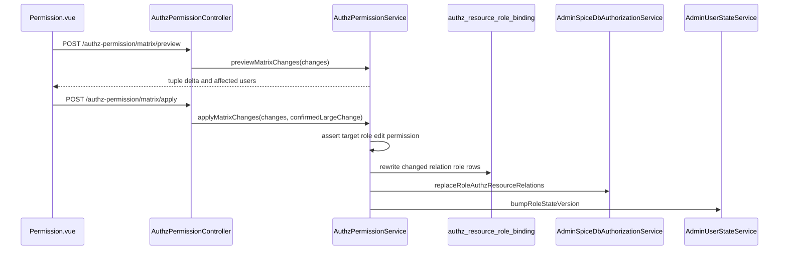

# Role 模块与 SpiceDB 关系说明

## 1. 范围与依据代码

- `apps/admin-api/src/modules/system/roles/roles.controller.ts`
- `apps/admin-api/src/modules/system/roles/roles.service.ts`
- `apps/admin-api/src/modules/system/roles/dto/role.dto.ts`
- `apps/admin-api/src/modules/authz-permission/authz-permission.controller.ts`
- `apps/admin-api/src/modules/authz-permission/authz-permission.service.ts`
- `apps/admin-api/src/modules/spicedb/admin-spicedb-authorization.service.ts`
- `apps/admin-api/src/modules/spicedb-projection/base-relation-projection.service.ts`
- `apps/admin-web/src/views/system/role/Role.vue`
- `apps/admin-web/src/views/system/permission/Permission.vue`
- `spicedb/schema.zed`
- `scripts/sync-admin-api-manager-authz.ts`

## 2. 一句话总览

`SystemRolesService` 维护 `rbac_role`、`rbac_user_role`、`rbac_user_group_role`，并从 RBAC effective 表读取有效用户。核心 manager 这类关系授权由独立权限管理页写入 `authz_resource_role_binding` 并同步 SpiceDB。

## 2.1 当前 RBAC 边界

- 角色列表、角色详情、直接用户、用户组、有效用户都读取 RBAC 表或 RBAC effective 表。
- 角色直接用户和角色用户组写入后，只重建实际受影响用户的 effective 读模型。
- 角色状态或超管标记变化时，先计算拥有该角色以及依赖该角色的用户，再定向重建。
- system 角色入口保持既有响应结构，底层基础角色关系读取 RBAC 源表和 effective 表。
- SpiceDB 用于核心 manager relation、对象例外关系等关系权限点。

## 3. Role 接口清单

| 方法   | 路径                              | 作用                                                   |
| ------ | --------------------------------- | ------------------------------------------------------ |
| `POST` | `/role/query_role_list`           | 查询角色列表，返回创建按钮 meta 和行级关系编辑能力     |
| `GET`  | `/role/get_role_relations?id=...` | 查询角色直接用户、用户组和 RBAC effective 有效用户关系 |
| `POST` | `/role/create_role`               | 创建角色基础实体                                       |
| `POST` | `/role/update_role?id=...`        | 更新角色基础实体与启用状态                             |
| `POST` | `/role/delete_role?id=...`        | 删除角色并清理 AuthZ 源表与 SpiceDB 关系               |
| `POST` | `/role/assign_users`              | 替换角色直接用户                                       |
| `POST` | `/role/assign_user_groups`        | 替换角色用户组                                         |

角色模块不提供 manager 能力读取或写入接口；核心 manager 授权统一使用权限管理接口。

## 4. 权限管理接口

| 方法   | 路径                               | 作用                                                                |
| ------ | ---------------------------------- | ------------------------------------------------------------------- |
| `GET`  | `/authz-permission/matrix`         | 返回 SpiceDB schema 探测结果、核心 manager 模块、角色列表和授权状态 |
| `POST` | `/authz-permission/matrix/preview` | 预览批量 manager relation 授权变更影响                              |
| `POST` | `/authz-permission/matrix/apply`   | 应用批量 manager relation 授权变更                                  |

权限管理页菜单入口是 `system.permission.view`。页面只管理核心 manager relation 到角色的授权，不管理菜单 Page/Catalog 入口。

## 5. 关系语义

- 角色直接用户：`role:<roleId>#assignee@user:<userId>`。
- 角色用户组：`role:<roleId>#assignee@user_group:<groupId>#active_member`。
- 角色启用状态：`role:<roleId>#enabled@user:*`。
- 核心 manager 能力：`<manager>:default#<relation>@role:<roleId>`。
- 任务对象基础关系：`task:<taskId>#manager@task_manager:default`、`task:<taskId>#creator@user:<userId>`。

`menu` 只负责导航和页面入口；manager 能力由权限管理页写入 `authz_resource_role_binding`。

## 6. Manager 写入流程

任务模块的细粒度校验：

- 修改 `task_manager.viewer/creator/updater/deleter/runner` 需要目标角色 `role:<id>#assign_task_capability`。
- 修改 `task_manager.manager` 需要目标角色 `role:<id>#assign_task_resource`。
- 修改其他 manager 模块 relation 需要目标角色 `role:<id>#update`。
- 批量替换时任一目标角色不可编辑，整次请求失败，不做部分写入。

## 7. 数据源与同步

- `authz_resource_role_binding` 是 manager relation 的唯一源表。
- `resourceType` 存 manager 类型，例如 `user_manager`、`role_manager`、`task_manager`。
- `resourceId` 存 relation 名，例如 `viewer`、`creator`、`runner`、`manager`。
- `pnpm authz:sync:admin-api-managers` 会从源表和业务元数据重建核心 manager、对象基础关系和任务对象基础关系。

## 8. 前端边界

- `Role.vue` 提供角色列表、角色基础信息、直接用户分配、用户组分配和有效用户查看。
- `Permission.vue` 提供“按实体”和“按角色”两个视图，负责核心 manager 能力授权。
- 菜单 Page/Catalog 入口仍在菜单页分配，不在权限管理页分配。
- 非核心 schema permission 只在权限管理页展示表达式，不开放授权控件。

## 9. 回归用例

- 角色页保存直接用户后，`role#assignee@user` 和投影表一致。
- 角色页保存用户组后，`role#assignee@user_group#active_member` 和投影表一致。
- 权限管理页给角色分配 `task_manager#runner` 后，源表和 SpiceDB `task_manager:default#runner@role:<id>` 一致。
- 权限管理页移除 `user_manager#creator` 后，对应创建按钮消失且创建接口 403。
- 菜单页分配角色只影响页面入口，不写任何核心 manager relation。
