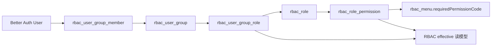
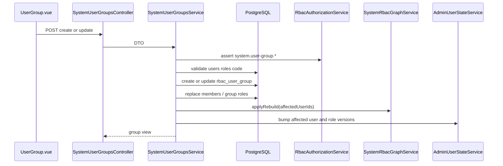

# UserGroup 模块与 RBAC 用户组关系说明

## 1. 范围与依据代码

- `apps/admin-api/src/modules/system/user-groups/user-groups.controller.ts`
- `apps/admin-api/src/modules/system/user-groups/user-groups.service.ts`
- `apps/admin-api/src/modules/system/user-groups/dto/user-group.dto.ts`
- `apps/admin-api/src/modules/system/rbac/rbac-graph.service.ts`
- `apps/admin-api/src/modules/system/rbac/rbac-authorization.service.ts`
- `prisma/admin/rbac.prisma`
- `apps/admin-web/src/views/system/user-group/UserGroup.vue`

## 2. 一句话总览

用户组元数据、成员和角色分配都保存在 `rbac_*` 表。用户通过用户组继承角色后，`SystemRbacGraphService` 重建 effective 角色、权限和可见菜单；用户组是否生效由 `rbac_user_group.status` 控制。system 用户组入口读取 RBAC 表和 effective 表。

## 3. 接口清单

| 方法   | 路径                                          | 作用                                     |
| ------ | --------------------------------------------- | ---------------------------------------- |
| `POST` | `/user-group/query_user_group_list`           | 查询用户组列表                           |
| `GET`  | `/user-group/detail?id=...`                   | 查询用户组详情                           |
| `POST` | `/user-group/create_user_group`               | 创建用户组                               |
| `POST` | `/user-group/update_user_group?id=...`        | 更新用户组                               |
| `POST` | `/user-group/delete_user_group?id=...`        | 删除用户组                               |
| `GET`  | `/user-group/get_user_group_relations?id=...` | 查询成员、角色和 RBAC effective 可见菜单 |

## 4. 数据关系

核心表：

- 成员：`rbac_user_group_member`
- 用户组角色：`rbac_user_group_role`
- 可见菜单：通过角色权限匹配 `rbac_menu.required_permission_code`

## 5. 创建与更新流程

## 6. 补偿与清理

- 创建或更新时只写 RBAC 源表；失败由数据库事务回滚。
- 成员或角色变化后只重建受影响成员的 effective 读模型，并刷新相关角色状态版本。
- 用户组列表会在分页查出用户组后批量读取成员 ID 和角色 ID，再组装视图，避免每条用户组各查一次成员和角色关系。
- 删除时先清理用户组成员、用户组角色和对象例外，再软删除或删除用户组记录。
- SpiceDB 关系权限用于对象例外或细粒度关系能力；用户组基础成员、角色和菜单可见性均以 RBAC 源表/effective 表为准。

## 7. 前端页面

页面路径：

- `apps/admin-web/src/views/system/user-group/UserGroup.vue`

功能：

- 用户组列表。
- 创建、编辑、删除。
- 多选成员用户。
- 多选角色。
- 启用、禁用。

## 8. 回归用例

- 创建用户组后，成员和角色关系能在详情中回显。
- 创建用户组后，`rbac_user_group_member` 和 `rbac_user_group_role` 能正确回显。
- 给用户组分配角色后，成员重新登录可获得对应菜单。
- 禁用用户组后，成员停止继承该组角色。
- 删除用户组后，成员、角色关系和 effective 读模型收敛。
