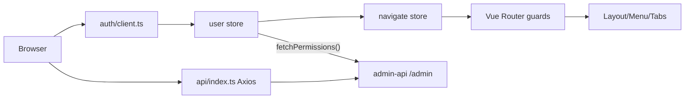

# Shiro Admin Web 项目说明

## 1. 依据代码清单

- `apps/admin-web/src/main.ts`
- `apps/admin-web/src/App.vue`
- `apps/admin-web/src/auth/client.ts`
- `apps/admin-web/src/api/index.ts`
- `apps/admin-web/src/api/account.ts`
- `apps/admin-web/src/router/index.ts`
- `apps/admin-web/src/router/gruad/userLoginInfoGuard.ts`
- `apps/admin-web/src/router/gruad/permissionGuard.ts`
- `apps/admin-web/src/store/modules/user/index.ts`
- `apps/admin-web/src/store/modules/navigate/index.ts`
- `apps/admin-web/src/store/modules/multipleTab/index.ts`
- `apps/admin-web/src/utils/permission.ts`
- `apps/admin-web/src/layout/Layout.vue`
- `apps/admin-web/src/components/GiTable/GiTable.vue`
- `apps/admin-web/src/components/GiPageLayout/GiPageLayout.vue`
- `apps/admin-web/src/components/CodeViewer/CodeViewer.vue`

## 2. 一句话总览

`admin-web` 是 Shiro Nya 后台管理前端，基于 Vue 3、Vite、Pinia、Vue Router、Arco Design 和 Naive UI；登录态由 Better Auth client 管理，菜单和按钮权限来自 `admin-api` 的 `/account/navigation`，动态路由以数据库菜单元数据为准。

## 3. 启动与构建

| 命令 | 作用 |
| --- | --- |
| `pnpm --filter ./apps/admin-web dev` | 启动本地 Vite 开发服务 |
| `pnpm --filter ./apps/admin-web dev:remote` | 使用 remote_dev mode 启动 |
| `pnpm --filter ./apps/admin-web build` | 运行 `vue-tsc` 并构建生产包 |
| `pnpm --filter ./apps/admin-web preview` | 预览构建产物 |

根目录脚本 `pnpm start:admin-web:dev` 和 `pnpm build:admin-web` 会转发到本应用。

## 4. 运行时链路

## 5. 登录、会话与权限

- `auth/client.ts` 封装 Better Auth client、Bearer token 存储、session 快照、伪装会话和登出。
- `user` store 负责登录、恢复会话、拉取 `/account/navigation`、维护 `permissions` 和处理 `x-user-state-changed` 刷新。
- `navigate` store 接收后端菜单，排序后转换成 Vue Router 动态路由、侧边栏菜单、面包屑和常驻标签。
- `permissionGuard.ts` 要求后台权限路由配置 `meta.requiredPermissionCode`，并调用 `hasPermission()` 做前端页面级拦截。
- `hasPermission()` 只检查 `/account/navigation.permissions` 形成的集合，不做角色继承、通配符或 SpiceDB 推导。

## 6. 菜单与页面约定

- 侧边栏显示以 `admin-api` 返回的数据库菜单为准。
- 静态路由只负责登录页、首页、错误页和直接导航入口。
- 动态菜单 meta 中的 `id`、`title`、`icon`、`requiredPermissionCode` 会同步到标签页和面包屑。
- RBAC 页面使用 `GiPageLayout`、`GiTable` 和表格内置搜索/工具栏。
- ABAC 页面使用 `AbacShell`、`GiPageLayout`、`GiTable`、`CodeViewer` 和共享 `tableOptions`。

## 7. 主要页面域

- `views/system/rbac/*`：后台 RBAC 角色、权限、菜单绑定、用户、用户组、effective 读模型和测试页。
- `views/system/abac/*`：admin-api Cerbos ABAC 字段、策略组、手写策略、预览、发布和运行时测试。
- `views/app/*`：通过 `admin-api -> app-api` 控制面管理 app 侧用户与 ABAC。
- `views/system/spicedb-data/*`：SpiceDB schema、relationship、permission check、投影对账和图形化排障。
- `views/system/menu/*`、`views/system/role/*`、`views/system/user/*`：系统管理入口。

## 8. 开发注意事项

- 新页面要同时具备后端数据库菜单、`requiredPermissionCode` 和前端 route/component。
- 按钮态使用 `hasPermission(code)` 或 `RbacAuth`，最终接口授权仍由后端 RBAC 判定。
- 写操作接口成功后依赖服务端状态版本头触发会话、权限和菜单刷新。
- JSON、SpiceDB schema、ABAC policy 预览使用 `CodeViewer` 或 VS Code 编辑器包装。
- 后台 API 成功响应按 `{ data, code, message }` 读取，状态版本头通过 Axios 响应拦截器处理。
