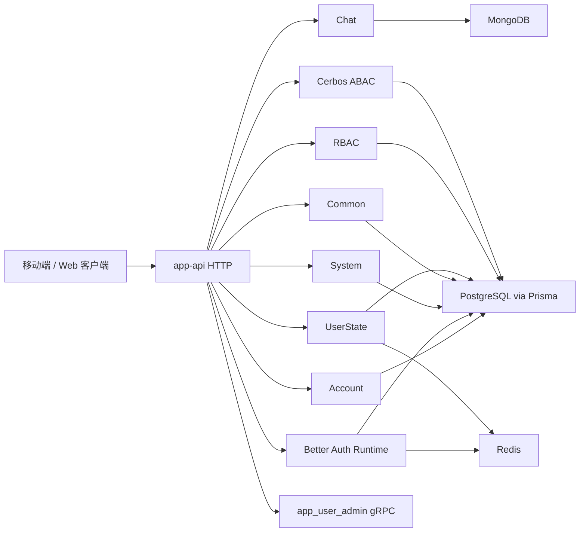
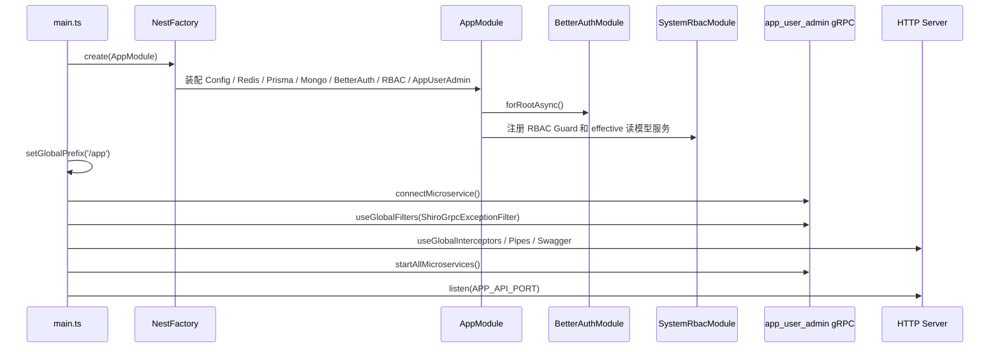
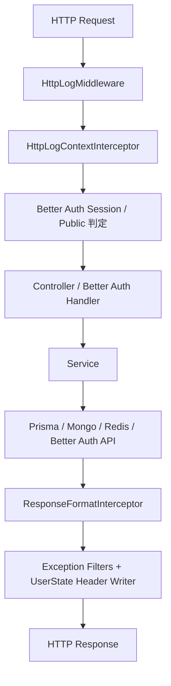
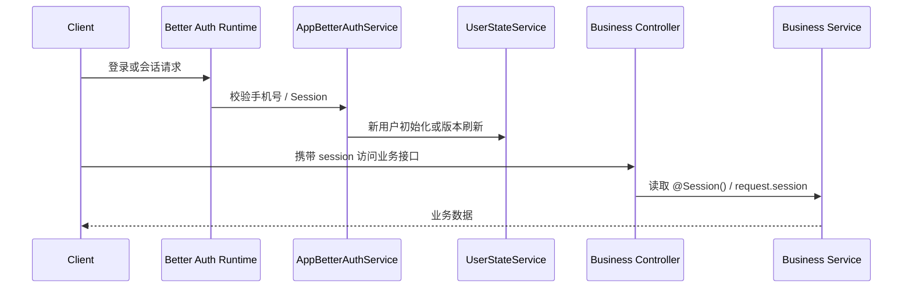
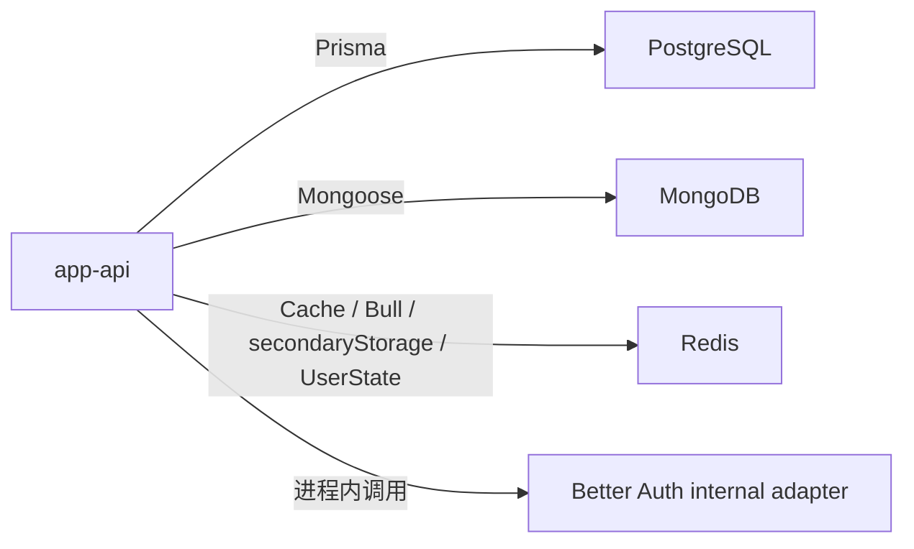
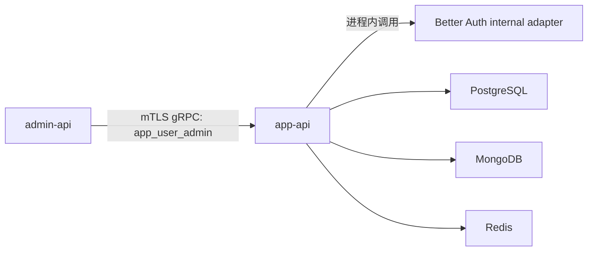

# app-api 架构总图

## 1. 建模说明
- 图中只描述当前源码里已经接线的运行链路。
- HTTP 链路统一带 `/app` 前缀；Better Auth 运行时路由由 `nestjs-better-auth` 挂载，不额外在本文件展开内部实现。
- gRPC 图只覆盖 `AppUserAdmin` 服务，因为这是当前代码里唯一对外微服务。
- `AppModule` 装配 Better Auth session、RBAC effective 读模型、Prisma、MongoDB、Redis 与业务服务，协同完成角色、菜单、用户状态和控制面链路。

## 2. 应用模块总览图

## 3. Bootstrap 时序图

## 4. 请求处理链路图

## 5. 认证与业务状态链路图

## 6. 数据与基础设施拓扑图

## 7. 跨服务交互图

