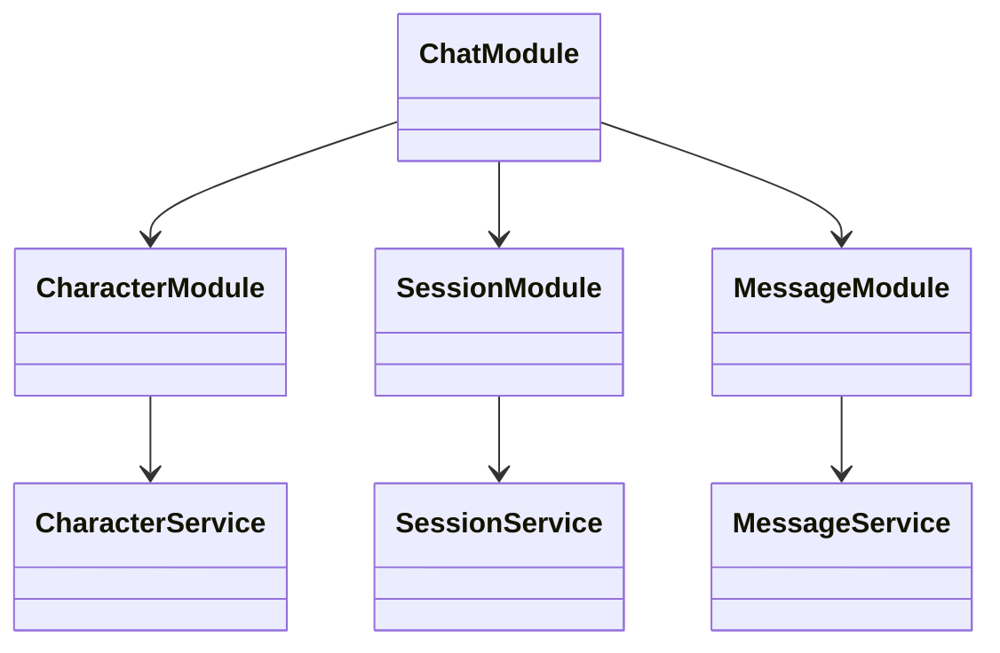
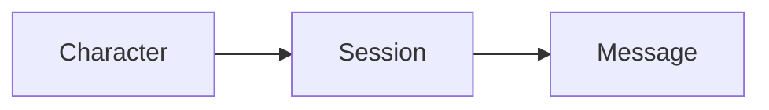
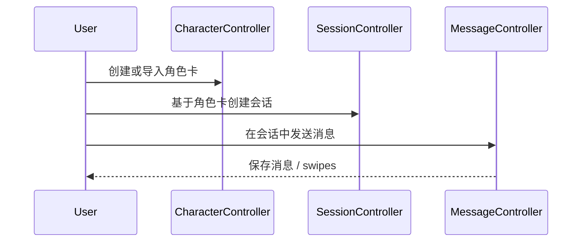
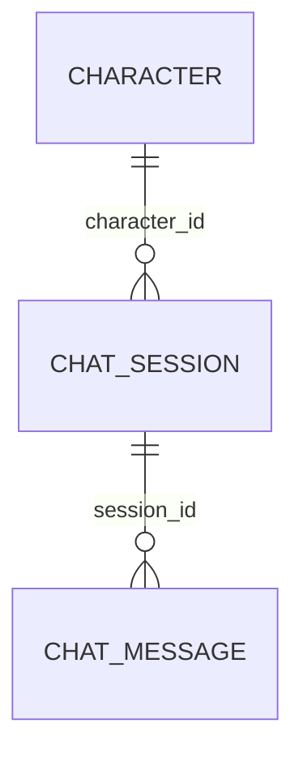

# chat 关系图

## 1. 建模说明
`chat` 自身只做聚合，因此类图重点表现三条子模块关系，ER 图表现 Mongo 三集合关联。

## 2. 模块分层结论
- `Character` 负责角色卡。
- `Session` 负责会话与角色快照。
- `Message` 负责会话内消息与 swipes。

```mermaid
classDiagram
    class ChatModule
    class CharacterModule
    class SessionModule
    class MessageModule
    class CharacterService
    class SessionService
    class MessageService

    ChatModule --> CharacterModule
    ChatModule --> SessionModule
    ChatModule --> MessageModule
    CharacterModule --> CharacterService
    SessionModule --> SessionService
    MessageModule --> MessageService
```

```mermaid
flowchart LR
    Character["Character"]
    Session["Session"]
    Message["Message"]

    Character --> Session
    Session --> Message
```

```mermaid
sequenceDiagram
    participant User as User
    participant Character as CharacterController
    participant Session as SessionController
    participant Message as MessageController

    User->>Character: 创建或导入角色卡
    User->>Session: 基于角色卡创建会话
    User->>Message: 在会话中发送消息
    Message-->>User: 保存消息 / swipes
```

```mermaid
erDiagram
    CHARACTER ||--o{ CHAT_SESSION : "character_id"
    CHAT_SESSION ||--o{ CHAT_MESSAGE : "session_id"
```
