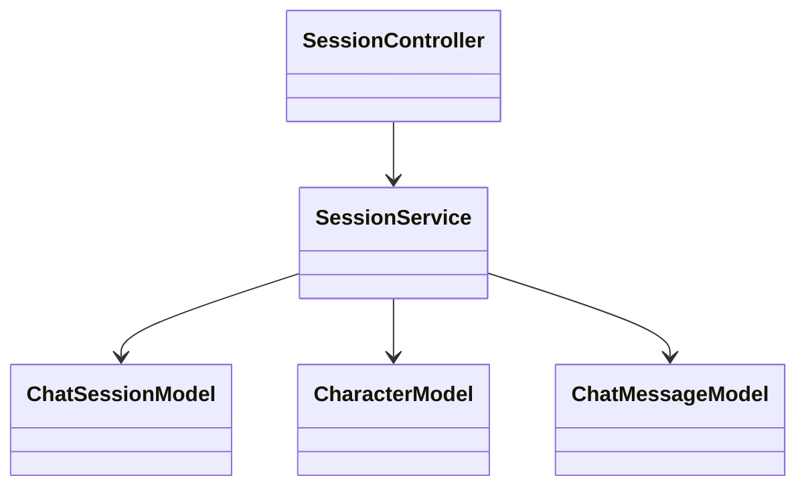
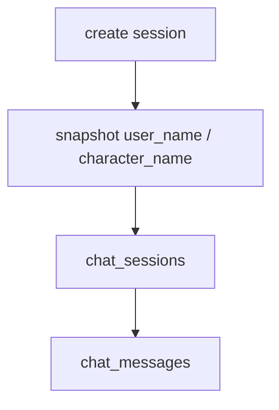
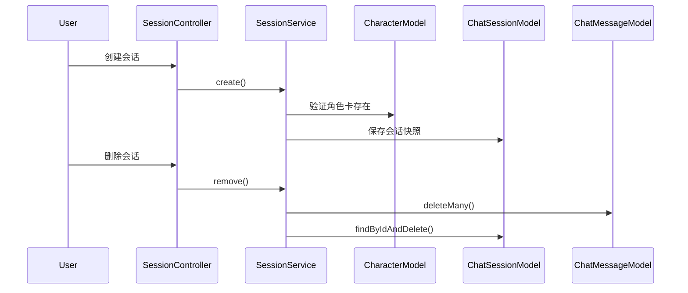
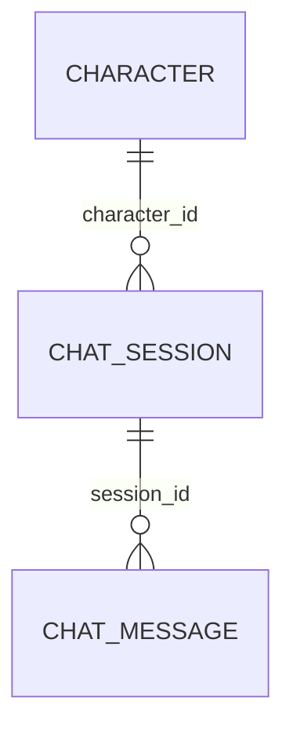

# session 关系图

## 1. 建模说明
本图描述会话创建、会话查询和会话删除级联消息的真实链路。

## 2. 模块分层结论
- `SessionController` 提供会话 HTTP 入口。
- `SessionService` 同时依赖会话、角色卡和消息模型。

```mermaid
classDiagram
    class SessionController
    class SessionService
    class ChatSessionModel
    class CharacterModel
    class ChatMessageModel

    SessionController --> SessionService
    SessionService --> ChatSessionModel
    SessionService --> CharacterModel
    SessionService --> ChatMessageModel
```

```mermaid
flowchart TD
    Create["create session"]
    Snapshot["snapshot user_name / character_name"]
    Session["chat_sessions"]
    Message["chat_messages"]

    Create --> Snapshot
    Snapshot --> Session
    Session --> Message
```

```mermaid
sequenceDiagram
    participant User as User
    participant Controller as SessionController
    participant Service as SessionService
    participant Character as CharacterModel
    participant Session as ChatSessionModel
    participant Message as ChatMessageModel

    User->>Controller: 创建会话
    Controller->>Service: create()
    Service->>Character: 验证角色卡存在
    Service->>Session: 保存会话快照
    User->>Controller: 删除会话
    Controller->>Service: remove()
    Service->>Message: deleteMany()
    Service->>Session: findByIdAndDelete()
```

```mermaid
erDiagram
    CHARACTER ||--o{ CHAT_SESSION : "character_id"
    CHAT_SESSION ||--o{ CHAT_MESSAGE : "session_id"
```
