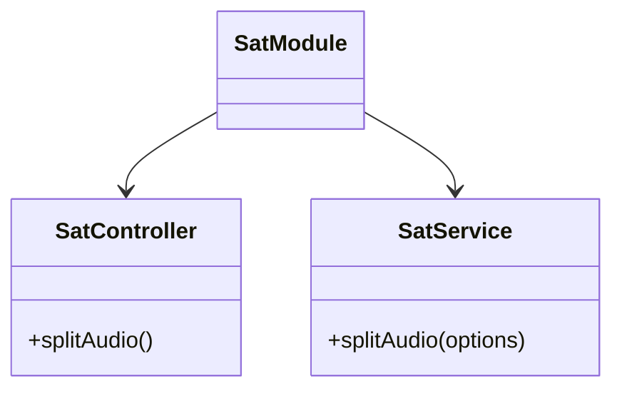
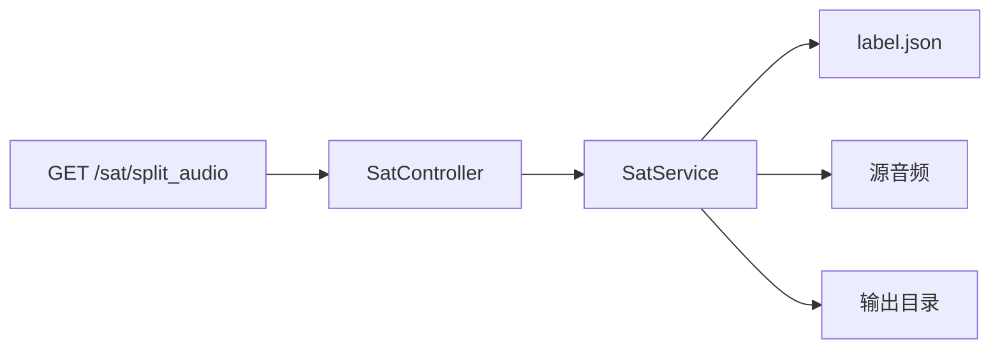
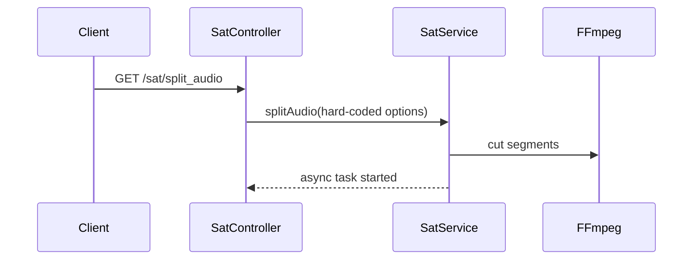
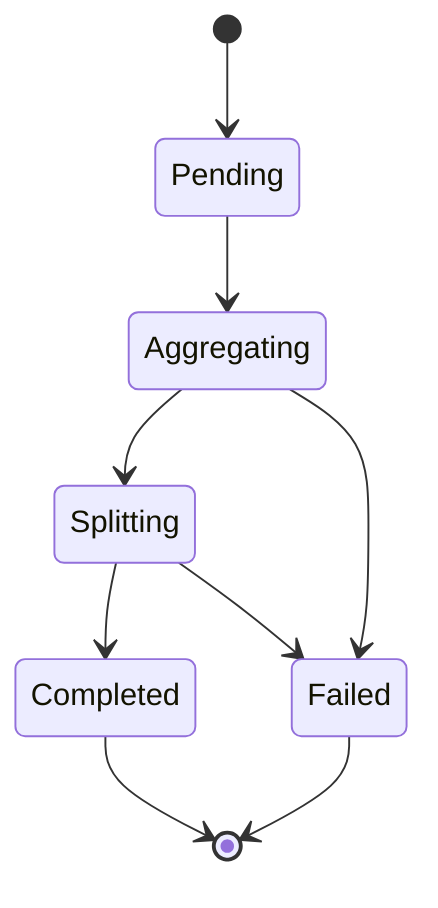

# Sat 模块关系图

## 1. 建模说明
后台 `SatModule` 是一个公开的本地工具接口，只负责触发音频切分，不依赖数据库。

## 2. 模块分层结论
- `SatController` 负责触发
- `SatService` 负责文件读写和 ffmpeg 切分
- 真实结果落到本地目录

```mermaid
classDiagram
    class SatModule
    class SatController {
        +splitAudio()
    }
    class SatService {
        +splitAudio(options)
    }

    SatModule --> SatController
    SatModule --> SatService
```

```mermaid
flowchart LR
    HTTP["GET /sat/split_audio"]
    Controller["SatController"]
    Service["SatService"]
    Label["label.json"]
    Audio["源音频"]
    Out["输出目录"]

    HTTP --> Controller --> Service
    Service --> Label
    Service --> Audio
    Service --> Out
```

```mermaid
sequenceDiagram
    participant Client as Client
    participant Controller as SatController
    participant Service as SatService
    participant FFmpeg as FFmpeg

    Client->>Controller: GET /sat/split_audio
    Controller->>Service: splitAudio(hard-coded options)
    Service->>FFmpeg: cut segments
    Service-->>Controller: async task started
```

```mermaid
stateDiagram-v2
    [*] --> Pending
    Pending --> Aggregating
    Aggregating --> Splitting
    Splitting --> Completed
    Aggregating --> Failed
    Splitting --> Failed
    Completed --> [*]
    Failed --> [*]
```
