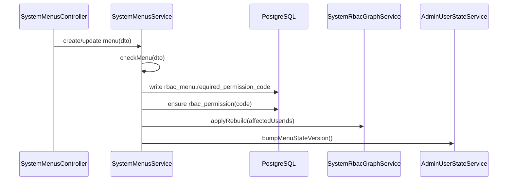
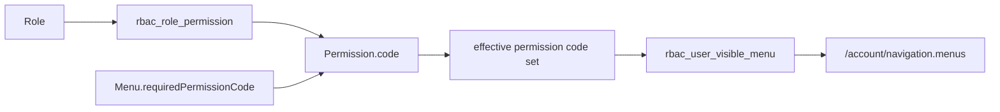

# Menu 模块与 RBAC 菜单关系说明

## 范围

- `apps/app-api/src/modules/system/menus/menus.controller.ts`
- `apps/app-api/src/modules/system/menus/menus.service.ts`
- `apps/app-api/src/modules/system/rbac/rbac-graph.service.ts`
- `prisma/app/authz.prisma`

## 一句话总览

`SystemMenusService` 维护 `rbac_menu`。菜单只声明 `requiredPermissionCode`，不授予权限；角色通过 `rbac_role_permission` 获得权限，用户最终可见菜单由 effective 权限 code 与菜单所需权限匹配出来。

## 数据模型

| 表                            | 职责                                         |
| ----------------------------- | -------------------------------------------- |
| `rbac_menu`              | 菜单元数据和 `required_permission_code` 声明 |
| `rbac_permission`        | 权限 code 权威表                             |
| `rbac_role_permission`   | 角色授予权限                                 |
| `rbac_user_visible_menu` | 用户可见菜单读模型                           |

菜单通过 `requiredPermissionCode` 声明可见性权限，基础授权不使用菜单-权限多对多绑定。

## 创建和更新

说明：

- Catalog/Page/Button 都必须声明 `requiredPermissionCode`。
- Page 只能挂在 Catalog 下，Button 只能挂在 Page 下，根节点只能创建 Catalog。
- 菜单创建或更新不会写菜单-权限绑定表；权限是否授予用户只看角色授权。
- 只有 `requiredPermissionCode` 或 `status` 改动才会触发 effective 定向重建；标题、排序、图标、路径等元数据变化只推进菜单版本。

## 导航可见性

`SystemRbacGraphService.applyRebuild(userIds)` 会把目标用户的有效权限展开后，按 `rbac_menu.required_permission_code in effectiveCodes` 生成 `rbac_user_visible_menu`。菜单权限码变化会同时包含持有对应权限的用户和超管用户。

## 删除

删除菜单时会：

1. 校验当前操作者具备 `system.menu.delete`。
2. 清理 `rbac_user_visible_menu` 中该菜单的读模型行。
3. 删除 `rbac_menu`。
4. 按菜单 `requiredPermissionCode` 计算受影响用户，定向重建 effective 读模型并 bump 菜单版本。

如果菜单的所需权限还被角色授予，删除菜单本身不会删除权限；权限是独立授权事实，是否回收应在 RBAC 权限或角色页处理。

## 回归点

- 新建菜单后，`/account/navigation` 只有在用户拥有该菜单 `requiredPermissionCode` 时才返回该菜单。
- Button 不进入 `menus`，但其权限 code 可出现在 `permissions` 中用于按钮态。
- 修改菜单 `requiredPermissionCode` 后，需要重建 effective 并刷新前端菜单状态。
- 删除权限前如果仍被菜单声明为 `requiredPermissionCode`，后端应拒绝删除权限。

