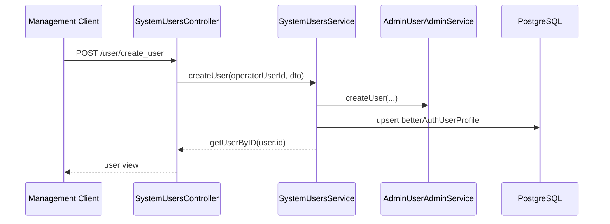

# User 模块与 RBAC 角色关系说明

## 1. 范围与依据代码

- `apps/app-api/src/modules/system/users/users.controller.ts`
- `apps/app-api/src/modules/system/users/users.service.ts`
- `apps/app-api/src/modules/system/users/dto/user.dto.ts`
- `apps/app-api/src/modules/better-auth/admin-user-admin.service.ts`
- `apps/app-api/src/modules/system/rbac/rbac-graph.service.ts`
- `prisma/app/authz.prisma`

## 2. 一句话总览

`SystemUsersService` 通过 Better Auth 管理 app 侧用户主表，通过业务库维护 profile；角色、用户组、有效角色和可见菜单关系都读取 RBAC 源表或 effective 读模型。用户直接角色分配由角色页和 RBAC 用户页关系管理维护。

## 3. 接口清单

| 方法   | 路径                         | 作用             |
| ------ | ---------------------------- | ---------------- |
| `POST` | `/user/query_user_list`      | 查询后台用户列表 |
| `POST` | `/user/create_user`          | 创建后台用户     |
| `POST` | `/user/update_user?id=...`   | 更新后台用户     |
| `POST` | `/user/delete_user?id=...`   | 删除后台用户     |
| `POST` | `/user/reset_password`       | 重置用户密码     |
| `POST` | `/user/query_user_sessions`  | 分页查询用户会话 |
| `POST` | `/user/revoke_user_sessions` | 撤销用户会话     |

## 4. 创建与更新流程

## 5. 返回字段含义

- `roleIds`：用户直接角色，来自 `rbac_user_role`。
- `effectiveRoleIds`：来自 `rbac_effective_user_role`，只包含用户直接角色和用户组角色；角色继承只展开权限，不写入 effective role。
- `profile` 相关字段：来自 `app_better_auth_user_profile`。
- Better Auth 主表字段：来自 `app_better_auth_user`。

## 6. 删除流程

删除用户时先在事务内清理 RBAC 用户关系和 effective 读模型：

- 清理 `rbac_user_role`。
- 清理 `rbac_user_group_member`。
- 清理 `rbac_effective_user_role`。
- 清理 `rbac_effective_user_permission`。
- 清理 `rbac_user_visible_menu`。
- 再调用 Better Auth admin 删除用户。

## 7. 边界与注意事项

- 用户直接角色关系由 RBAC 源表表达，并通过 effective 读模型提供最终角色、权限和菜单。
- 用户直接角色由角色页 `assign_users` 从角色视角维护；用户组角色由 UserGroup 模块维护。
- SpiceDB 用于对象关系权限；app 侧用户基础角色、用户组和菜单授权由 RBAC 源表与 effective 读模型处理。

## 8. 回归用例

- 创建用户后，Better Auth 用户主表和 profile 能正常回显。
- 通过角色页分配用户后，`rbac_user_role` 和 RBAC effective 读模型收敛。
- 用户详情同时返回 `roleIds` 和 `effectiveRoleIds`。
- 删除用户后，直接角色、用户组成员和 effective 读模型都被清理。
