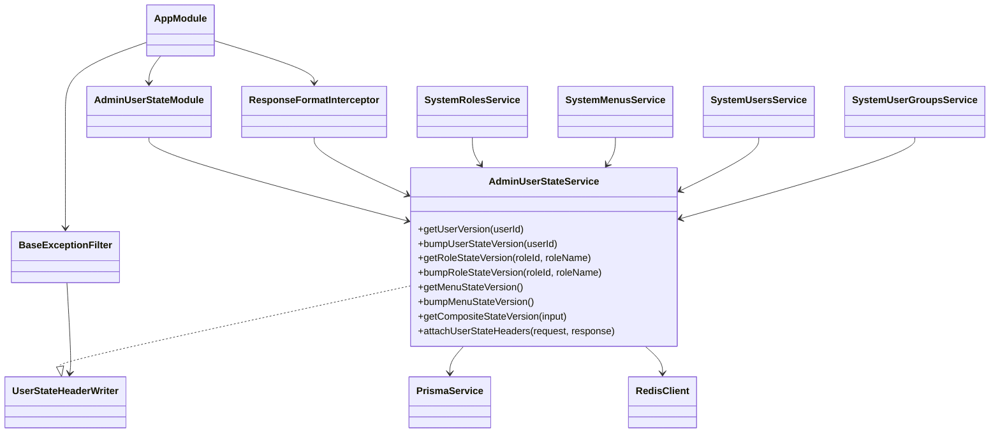
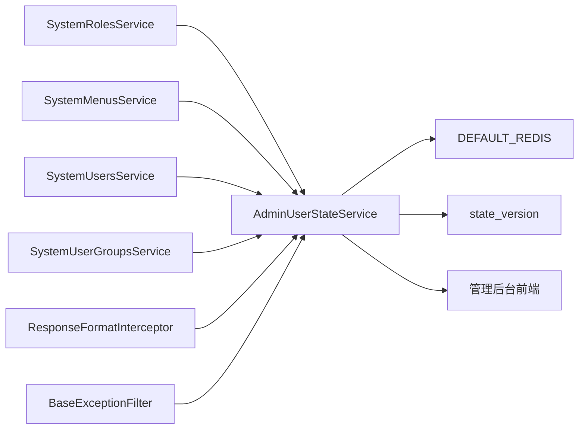
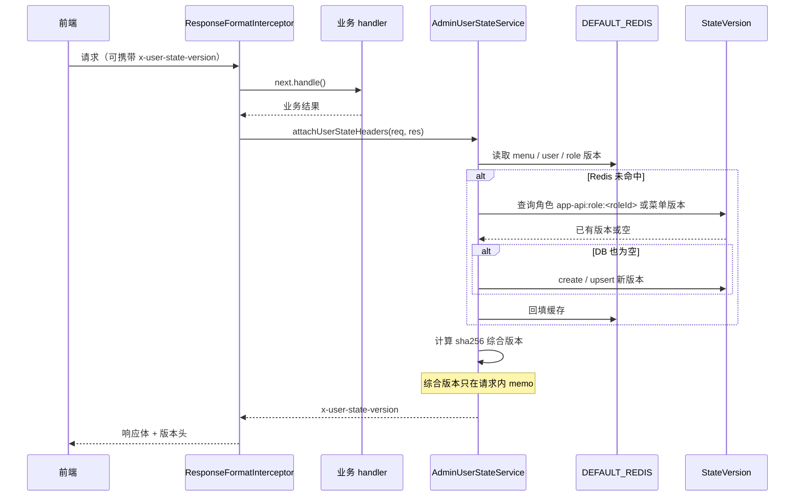
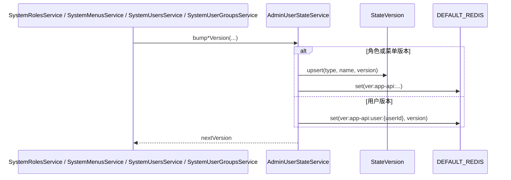
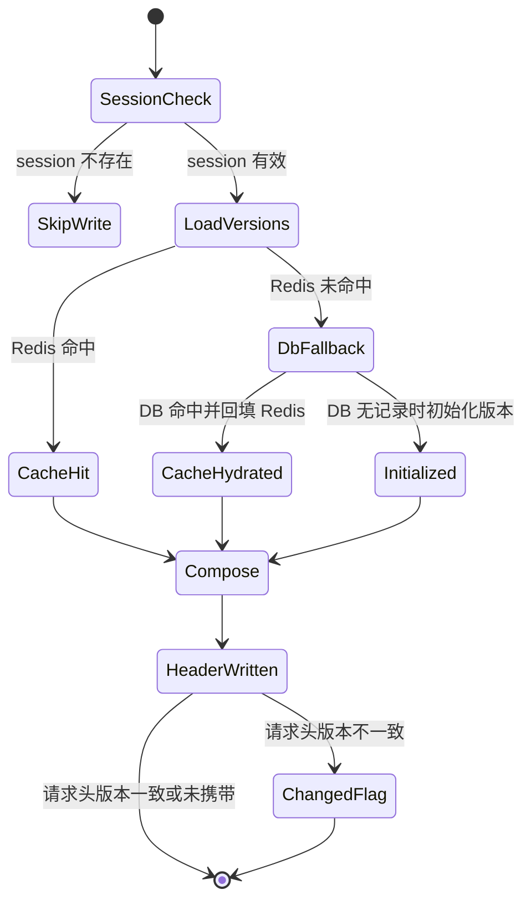
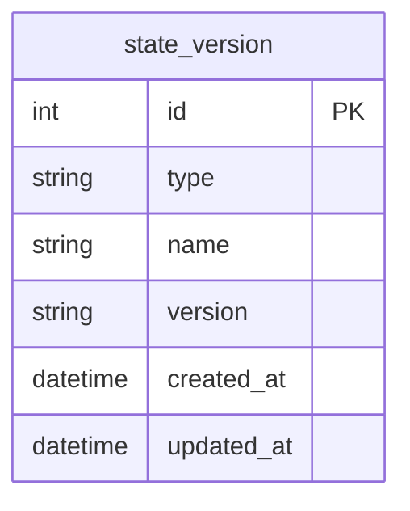

# UserState 模块关系图

## 1. 建模说明

`AdminUserStateModule` 是后台“状态版本同步”模块。它自身没有 controller，也不直接承接业务写请求，但它横跨正常响应链路、异常响应链路和后台写操作链路，是权限菜单刷新、用户态刷新、前端缓存失效判断的共同支点。

## 2. 模块分层结论

- `AdminUserStateService` 是唯一的业务核心，实现版本读写、综合版本计算和响应头写入
- 综合版本只做 request 内 Promise memo；跨请求缓存由账号导航的版本化 Redis key 承担
- `ResponseFormatInterceptor` 负责正常响应场景下的版本头落盘
- `BaseExceptionFilter` 通过 `USER_STATE_HEADER_WRITER` 在异常响应场景复用同一套头写入能力
- `SystemRolesService`、`SystemMenusService`、`SystemUsersService`、`SystemUserGroupsService` 是主要版本 bump 上游
- `PrismaService` 和 `DEFAULT_REDIS` 分别承担持久化和缓存职责

