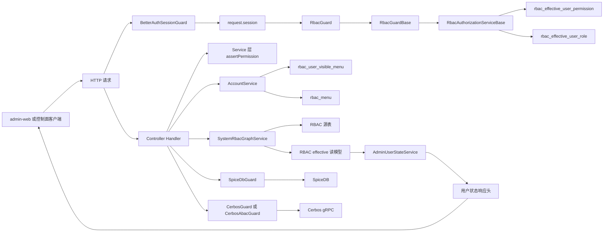
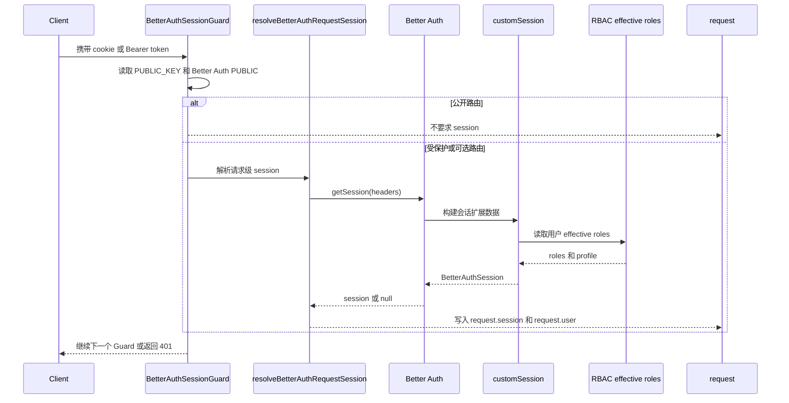
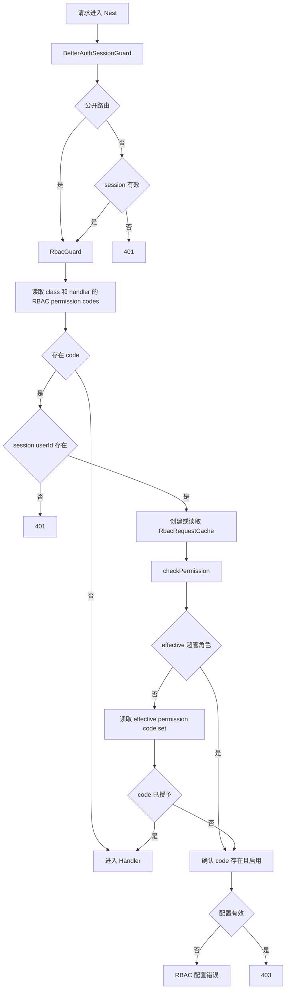
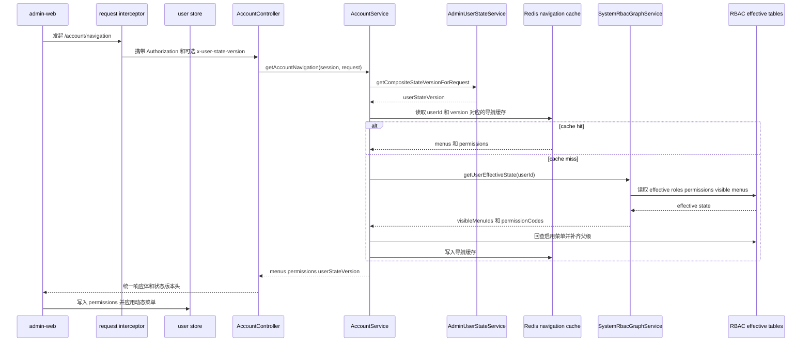
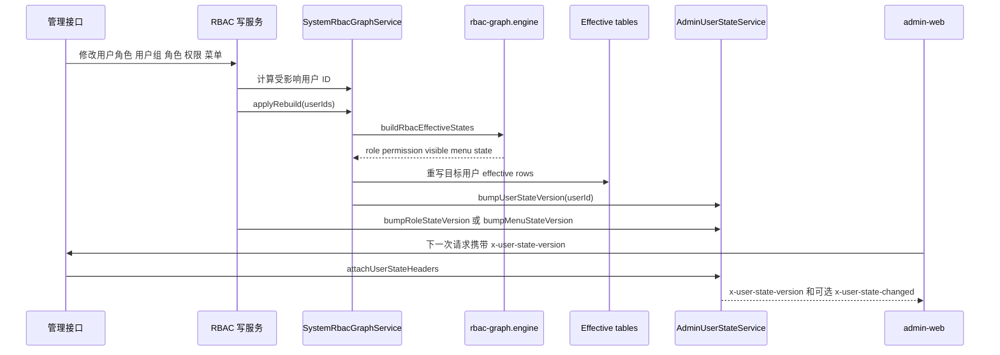

# Shiro Nya 权限架构与运行链路说明

## 1. 标题与范围

本文描述 `apps/admin-api`、`apps/app-api`、`apps/admin-web` 与共享库中的认证、RBAC、菜单可见性、用户状态版本、SpiceDB 和 Cerbos ABAC 运行链路。

范围包含：

- Better Auth 会话解析与 `request.session` 构建。
- 全局 `BetterAuthSessionGuard` 与 `RbacGuard` 的执行顺序。
- `@RbacPermission()`、`RbacAuthorizationService`、RBAC effective 读模型和请求内缓存。
- `/account/navigation` 菜单过滤、按钮权限返回和 Redis 导航缓存。
- 用户、角色、菜单、权限、用户组、对象例外授权变更后的版本同步。
- SpiceDB、Cerbos Policy、Cerbos ABAC 与 RBAC 的边界。

本文不描述部署脚本、部署包、Docker 编排或 deploy 工具链。

## 2. 依据代码清单

- `apps/admin-api/src/modules/app.module.ts`
- `apps/app-api/src/modules/app.module.ts`
- `apps/admin-api/src/modules/better-auth/better-auth-session.guard.ts`
- `apps/app-api/src/modules/better-auth/better-auth-session.guard.ts`
- `apps/admin-api/src/modules/better-auth/better-auth-request.ts`
- `apps/app-api/src/modules/better-auth/better-auth-request.ts`
- `apps/admin-api/src/modules/better-auth/better-auth-options.ts`
- `apps/app-api/src/modules/better-auth/better-auth-options.ts`
- `apps/admin-api/src/common/interceptors/response-format.interceptor.ts`
- `apps/app-api/src/common/interceptors/response-format.interceptor.ts`
- `libs/common/src/filters/base-exception.filter.ts`
- `libs/common/src/filters/user-state-header-writer.interface.ts`
- `libs/rbac-core/src/runtime/rbac-permission.decorator.ts`
- `libs/rbac-core/src/runtime/rbac-permission.metadata.ts`
- `libs/rbac-core/src/runtime/rbac-request-cache.ts`
- `libs/rbac-core/src/runtime/rbac-guard.ts`
- `libs/rbac-core/src/runtime/rbac-authorization.service.ts`
- `libs/rbac-core/src/runtime/rbac-effective-permission-cache.service.ts`
- `libs/rbac-core/src/graph/rbac-graph.engine.ts`
- `apps/admin-api/src/modules/system/rbac/rbac.guard.ts`
- `apps/app-api/src/modules/system/rbac/rbac.guard.ts`
- `apps/admin-api/src/modules/system/rbac/rbac-authorization.service.ts`
- `apps/app-api/src/modules/system/rbac/rbac-authorization.service.ts`
- `apps/admin-api/src/modules/system/rbac/rbac-graph.service.ts`
- `apps/app-api/src/modules/system/rbac/rbac-graph.service.ts`
- `apps/admin-api/src/modules/account/account.controller.ts`
- `apps/app-api/src/modules/account/account.controller.ts`
- `apps/admin-api/src/modules/account/account.service.ts`
- `apps/app-api/src/modules/account/account.service.ts`
- `apps/admin-api/src/modules/system/menus/menus.service.ts`
- `apps/admin-api/src/modules/system/roles/roles.service.ts`
- `apps/admin-api/src/modules/system/assignments/assignments.service.ts`
- `apps/admin-api/src/modules/system/permissions/permissions.service.ts`
- `apps/admin-api/src/modules/authz-object-exception/authz-object-exception.service.ts`
- `apps/admin-api/src/modules/user-state/admin-user-state.service.ts`
- `apps/app-api/src/modules/user-state/admin-user-state.service.ts`
- `apps/admin-web/src/api/index.ts`
- `apps/admin-web/src/auth/client.ts`
- `apps/admin-web/src/store/modules/user/index.ts`
- `apps/admin-web/src/utils/permission.ts`
- `packages/spicedb-toolkit/nestjs/src/guard.ts`
- `packages/spicedb-toolkit/nestjs/src/decorators.ts`
- `packages/spicedb-toolkit/nestjs/src/service.ts`
- `packages/spicedb-toolkit/nestjs/src/interfaces.ts`
- `apps/admin-api/src/modules/spicedb/admin-spicedb-nestjs-resolvers.ts`
- `libs/cerbos/cerbos.guard.ts`
- `libs/cerbos/cerbos.service.ts`
- `libs/cerbos/cerbos.decorator.ts`
- `apps/admin-api/src/modules/system/abac/abac.module.ts`
- `apps/app-api/src/modules/app-user-admin/app-user-admin.module.ts`
- `libs/cerbos-abac/src/decorator.ts`
- `libs/cerbos-abac/src/module.ts`
- `libs/cerbos-abac/src/runtime.guard.ts`
- `libs/cerbos-abac/src/services/runtime.service.ts`
- `prisma/admin/rbac.prisma`
- `prisma/admin/authz.prisma`
- `prisma/admin/state.prisma`
- `prisma/admin/cerbos-abac.prisma`
- `prisma/app/authz.prisma`
- `prisma/app/state.prisma`
- `prisma/app/cerbos-abac.prisma`

## 3. 一句话总览

后台基础授权以 Better Auth session 作为身份入口，以 RBAC effective 读模型作为接口和菜单授权事实；SpiceDB、Cerbos Policy 与 Cerbos ABAC 是显式声明的关系或策略授权通道，不从 RBAC metadata 或菜单表推导授权对象。

权威来源与优化提示：

| 类型 | 内容 | 用途 |
| --- | --- | --- |
| 权威来源 | Better Auth session | 认证身份、当前用户 ID、会话角色快照 |
| 权威来源 | `rbac_role`、`rbac_user_group`、`rbac_permission`、`rbac_menu` 与关系表 | RBAC 主数据和授权配置 |
| 权威来源 | `rbac_effective_user_role`、`rbac_effective_user_permission`、`rbac_user_visible_menu` | 运行时授权、导航可见性、有效角色查询 |
| 权威来源 | SpiceDB relationship 与 `authz_*` 源表 | 显式对象关系授权和对象例外授权 |
| 权威来源 | Cerbos policy bundle 与 `cerbos_abac_*` 表 | Cerbos Policy 与 ABAC 运行时绑定 |
| 优化提示 | 请求内 `RbacRequestCache` | 同一 HTTP 请求内复用权限查询 |
| 优化提示 | effective permission code cache | 跨请求缓存用户 effective code set |
| 优化提示 | `/account/navigation` Redis cache | 按用户综合状态版本缓存导航结果 |
| 优化提示 | `x-user-state-version`、`x-user-state-changed` | 前端刷新会话、菜单和权限的协议信号 |
| 优化提示 | `admin-web` permission set | 前端界面态的 O(1) membership 判断，不替代后端接口鉴权 |

## 4. 总体架构图



## 5. 登录与会话构建流程



登录与会话规则：

- `BetterAuthSessionGuard` 只负责认证、可选会话、公开路由和封禁状态，不执行业务权限判断。
- `resolveBetterAuthRequestSession()` 在同一个 HTTP request 内缓存 `getSession()` 的 Promise，后面的 guard、resolver 或业务代码复用同一份 session。
- `@Public()` 只影响 Better Auth 会话要求，不跳过 RBAC。公开路由如果声明 RBAC permission code，匿名请求会在 RBAC 阶段返回 401。
- `apps/admin-api` 的 Better Auth `/get-session` 成功响应会通过 `admin-user-state-version` 插件补充 `x-user-state-version`。
- `apps/app-api` 的 Better Auth session 使用 `expo`、`apiKey`、`bearer`、`phoneNumber`、`customSession` 等插件；基础接口授权仍由后面的 RBAC 链路执行。

## 6. 请求鉴权流程



RBAC 运行规则：

- `@RbacPermission(code)` 通过 `createRbacPermissionDecorator()` 写入单个主权限 metadata，并调用应用侧 `RbacDeclarePermissions()`。
- `RbacDeclarePermissions()` 写入候选权限 metadata 与 `RBAC_REQUIRED_PERMISSION_CODES_METADATA_KEY`。
- `RbacGuardBase` 合并 class 与 handler 上的 code，去重后逐个调用 `checkPermission()`；多个 code 是全部通过语义。
- 没有 RBAC metadata 的路由不做 RBAC 判断，但仍受会话守卫影响。
- 超管角色通过 `rbac_effective_user_role.role.isSuperAdmin` 判断；超管允许所有已启用且未删除的 RBAC permission code。
- 配置错误不会被包装成普通无权限。目标 code 不存在、禁用或软删除时，应用侧 `RbacAuthorizationStore` 抛 RBAC 配置错误。
- Service 层可以直接调用 `RbacAuthorizationService.assertPermission(actorId, code)`，用于写操作、任务、RPC/gRPC 或可复用方法。

## 7. 菜单过滤流程



菜单过滤规则：

- `rbac_menu.requiredPermissionCode` 是菜单可见性的声明字段；菜单不授予权限。
- `SystemRbacGraphService.applyRebuild()` 根据用户直接角色、用户组角色、角色继承、角色权限和菜单声明生成 `rbac_user_visible_menu`。
- `AccountService.getAccountNavigation()` 从 `rbac_user_visible_menu` 取可见菜单 ID，再回查启用菜单。
- Button 类型菜单不进入 `menus` 返回；按钮能力通过 `permissions` 中的 RBAC code 给前端判断。
- 导航结果的 Redis key 包含 `userId` 和综合状态版本。版本变化后会自然读取另一份缓存。
- `admin-web` 的 `hasPermission()` 只检查 `/account/navigation.permissions` 形成的 permission set；它不做通配、表达式、角色继承或 SpiceDB 推导。
- 前端请求拦截器会携带本地 `x-user-state-version`；响应拦截器读取服务端版本并持久化。
- `x-user-state-changed: 1` 是可选响应头。该头出现时，前端触发一次去重后的会话、菜单和权限刷新；`/account/navigation` 自身不反向触发刷新，避免等待自身完成。

## 8. 权限变更同步流程



同步规则：

- `SystemRbacAssignmentsService` 处理用户角色、用户组成员、用户组角色、角色用户、角色用户组、角色继承、角色权限、权限角色、菜单可见角色关系；写入后重建受影响用户。
- `SystemMenusService` 创建、更新、删除菜单时校验 `requiredPermissionCode`，可见性变化时重建受影响用户，并 bump 菜单全局版本。
- `SystemRolesService` 创建、更新、删除角色时 bump 角色版本；角色状态或超管标记影响 effective 时重建受影响用户。
- `SystemRbacPermissionsService` 创建启用权限会重建超管用户；权限 code 或状态变化会重建显式持有该权限的用户和超管用户。
- `SystemRbacGraphService.applyRebuild()` 在事务中重写 `rbac_effective_user_role`、`rbac_effective_user_permission`、`rbac_user_visible_menu`，然后 bump 目标用户版本。
- `AdminUserStateService.getCompositeStateVersion()` 使用菜单版本、用户版本、角色版本生成 SHA256，作为导航缓存和前端刷新协议的共同版本。
- `ResponseFormatInterceptor` 在正常业务响应上调用 `attachUserStateHeaders()`；`BaseExceptionFilter` 在异常响应返回前也会尝试写入用户状态头。
- 状态头写入失败只记录日志，不阻断业务响应。

## 9. 数据关系图

```mermaid
erDiagram
    BetterAuthUser ||--o{ RbacUserRole : has
    BetterAuthUser ||--o{ RbacUserGroupMember : joins
    BetterAuthUser ||--o{ RbacEffectiveUserRole : effective
    BetterAuthUser ||--o{ RbacEffectiveUserPermission : effective
    BetterAuthUser ||--o{ RbacUserVisibleMenu : visible
    RbacUserGroup ||--o{ RbacUserGroupMember : contains
    RbacUserGroup ||--o{ RbacUserGroupRole : grants
    RbacRole ||--o{ RbacUserRole : assigned
    RbacRole ||--o{ RbacUserGroupRole : group_grants
    RbacRole ||--o{ RbacRolePermission : grants
    RbacRole ||--o{ RbacRoleInherit : child
    RbacRole ||--o{ RbacRoleInherit : parent
    RbacPermission ||--o{ RbacRolePermission : granted
    RbacPermission ||--o| RbacMenu : required_by
    RbacPermissionGroup ||--o{ RbacPermission : groups
    RbacPermissionGroup ||--o{ RbacMenu : groups
    RbacMenu ||--o{ RbacMenu : children
    RbacMenu ||--o{ RbacUserVisibleMenu : visible_to
    RbacRole ||--o{ RbacEffectiveUserRole : effective_to
    RbacPermission ||--o{ RbacEffectiveUserPermission : effective_to
    AuthzResourceMetadata ||--o{ AuthzResourceRoleBinding : configures
    RbacRole ||--o{ AuthzResourceRoleBinding : binds
    BetterAuthUser ||--o{ AuthzObjectSubjectBinding : subject_user
    RbacRole ||--o{ AuthzObjectSubjectBinding : subject_role
    CerbosAbacPermission ||--o{ CerbosAbacPolicyGroupPermission : selected
    CerbosAbacPolicyGroup ||--o{ CerbosAbacPolicyGroupPermission : contains
    CerbosAbacPolicyGroup ||--o{ CerbosAbacConditionNode : conditions
    CerbosAbacPolicySnapshot ||--o{ CerbosAbacPolicyReleaseSnapshot : packaged
    CerbosAbacPolicyRelease ||--o{ CerbosAbacPolicyReleaseSnapshot : publishes
    SpiceDbProjectionCursor ||--o{ SpiceDbProjectionEventLog : tracks
    SpiceDbProjectionReconcileRun ||--o{ SpiceDbProjectionEventLog : audits
    StateVersion {
        Int id
        String name
        String type
        String version
    }
```



数据关系说明：

- `RbacEffectiveUserRole` 只保存用户直接角色和用户组角色的展开结果，不把角色继承链上的父角色写成用户有效角色。
- 角色继承作用在“角色到权限”的展开阶段，`rbac-graph.engine` 会通过父角色闭包合并权限。
- `RbacUserVisibleMenu` 是菜单过滤读模型，权限事实仍来自 RBAC 源表和 `RbacEffectiveUserPermission`。
- `StateVersion` 保存角色和菜单版本；用户版本保存在 Redis。综合版本由服务端按请求计算。
- `AuthzObjectSubjectBinding` 是对象例外授权源表；应用后会同步 SpiceDB relationship，并刷新受影响用户或角色状态版本。
- `CerbosAbacPermission` 可以保存 RBAC permission 的快照字段；ABAC 绑定不回写 RBAC 表。

## 10. 边界与注意事项

RBAC 边界：

- `libs/rbac-core` 不依赖 Prisma。它只提供 metadata、guard base、authorization base、请求 cache、effective permission cache base 和图计算纯函数。
- `apps/admin-api` 与 `apps/app-api` 各自实现 `RbacAuthorizationStore`，读取各自数据库中的 RBAC 表。
- `RbacAuthorizationServiceBase` 的判断对象是 permission code membership，不处理对象级关系和资源属性。
- `RbacRequestCache` 与 effective permission code cache 都是性能优化；cache miss 或 cache 异常回到数据库读模型。

角色展开边界：

- 用户角色来源有两类：`RbacUserRole` 直接分配、`RbacUserGroupMember -> RbacUserGroupRole` 间接分配。
- 角色继承只参与权限展开和受影响角色计算。
- 超管角色来自 effective role 表中启用且未删除的 `isSuperAdmin` 角色。

菜单边界：

- 菜单显示以 live DB 中 `rbac_menu` 和 `rbac_user_visible_menu` 为准。
- 静态路由只能支持直接导航；登录后侧边栏是否出现取决于数据库菜单、`requiredPermissionCode` 和当前用户 effective permission。
- 菜单分组与权限分组只服务管理页面归类，不改变授权判断。

SpiceDB 边界：

- `SpiceDbGuard` 只读取 `SPICEDB_PERMISSION_METADATA_KEY` 与 `SPICEDB_RESOLVERS_METADATA_KEY`。
- `createSpiceDbNestOptions()` 只提供 subject resolver：它从 Better Auth session 解析 `user:<id>`。
- SpiceDB resource 必须由 `@SpiceDbPermission({ resourceType, resourceId })` 或 `@SpiceDbResolvers({ resource })` 显式提供。
- SpiceDB 不读取 RBAC permission metadata，也不按 RBAC 菜单表推导 resource。
- `AdminSpiceDbAuthorizationService` 服务 relationship 读写、permission check、lookup、投影同步和对象关系能力；基础菜单和接口 RBAC 不经由该服务。

Cerbos 边界：

- `CerbosGuardFor(prefix)` 读取 `@CerbosPolicy()` 的 resource、action 和属性配置，再调用对应 prefix 的 `CerbosService.isAllowed()`。
- `CerbosModule.forRoot()` 的 `userFromContext` 从 `request.session` 取用户和角色 code；角色展开由调用方传入，不由 Cerbos guard 查询 RBAC 表。
- `AbacPermission(code)` 写入 `CERBOS_ABAC_PERMISSION_KEY`；`CerbosAbacGuard` 读取该 metadata，并交给 `CerbosAbacRuntimeService` 根据 code 查询 ABAC 绑定。
- `CerbosAbacModule.forRoot()` 的未绑定运行模式默认是 `ALLOW`，可通过 `unboundRuntimeMode: "DENY"` 调整；绑定为 BUILTIN 时使用内置 resource kind，并向 principal roles 添加 ABAC runtime role。
- Cerbos ABAC runtime binding cache 是 best effort，失败时回数据库查询。

响应头与前端刷新：

- `x-user-state-version` 是可选请求头和响应头。客户端上送本地版本，服务端返回最新综合版本。
- `x-user-state-changed` 是可选响应头。值为 `1` 表示客户端版本与服务端版本不同。
- `Access-Control-Expose-Headers` 需要暴露用户状态头，浏览器前端才能读取。
- `x-admin-api-devtools`、`x-app-api-devtools` 和对应 enabled 响应头只服务调试，不参与授权事实。

## 11. 联调/回归用例

基础认证与 RBAC：

- 未携带有效 session 请求受保护接口，返回 401。
- 已登录但缺少接口所需 RBAC code，请求声明了 `@RbacPermission()` 的接口返回 403。
- 接口声明的 RBAC code 不存在、禁用或软删除，超管用户也收到 RBAC 配置错误。
- 没有 RBAC metadata 的受保护接口只校验 session；敏感写接口应在路由或 service 层声明 RBAC 权限。
- `@Public()` 接口不要求 session；同一接口如果声明 RBAC 权限，匿名请求仍在 RBAC 阶段返回 401。

菜单与按钮权限：

- 给角色授予页面菜单的 `requiredPermissionCode` 后，重建 effective，用户 `/account/navigation` 返回该菜单及其必要父级。
- Button 类型菜单不出现在 `menus`，对应 code 出现在 `permissions`。
- 修改菜单 `requiredPermissionCode` 或 `status` 后，受影响用户的 visible menu 读模型和菜单版本发生变化。
- 删除被菜单引用的 permission code 时，后端拒绝删除。

状态版本与缓存：

- 修改用户角色后，`rbac_effective_user_role`、`rbac_effective_user_permission`、`rbac_user_visible_menu` 被重写，目标用户版本变化。
- 前端携带过期 `x-user-state-version` 请求普通业务接口时，响应包含最新 `x-user-state-version` 和 `x-user-state-changed: 1`。
- `/account/navigation` 响应不触发自身递归刷新。
- Redis 不可用时，用户状态头写入或导航缓存失败不影响授权事实和业务响应。

SpiceDB 与 Cerbos：

- 使用 `@SpiceDbPermission()` 的路由必须能解析 subject 和 resource；缺失时返回拒绝。
- SpiceDB 路由不读取 `@RbacPermission()` metadata；需要 RBAC 与 SpiceDB 同时生效时，应分别声明 RBAC 装饰器和 SpiceDB guard。
- `@CerbosPolicy()` 路由按 Cerbos resource/action 判断；缺少 session 角色或 Cerbos 返回 deny 时拒绝。
- `@AbacPermission()` 路由按 ABAC binding 和 Cerbos policy 判断；未绑定 code 的结果与 `unboundRuntimeMode` 一致。

建议命令：

```bash
pnpm exec jest apps/admin-api/src/modules/system/rbac/rbac-authorization.service.spec.ts apps/app-api/src/modules/system/rbac/rbac-authorization.service.spec.ts --runInBand
pnpm exec jest apps/admin-api/src/modules/system/rbac/rbac-graph.service.spec.ts apps/app-api/src/modules/system/rbac/rbac-graph.service.spec.ts --runInBand
pnpm exec jest apps/admin-api/src/modules/user-state/admin-user-state.service.spec.ts apps/app-api/src/modules/user-state/admin-user-state.service.spec.ts --runInBand
pnpm build:admin-api
pnpm build:app-api
```
