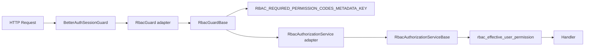
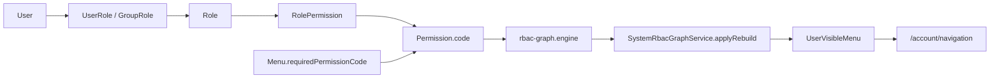

# ShiroAdmin 权限系统代码架构说明

本文按当前代码描述 `apps/admin-api` 的权限系统。admin 基础授权由本地 RBAC 负责；SpiceDB 是显式关系授权和关系数据运维工具。重复的 RBAC 运行时骨架和图计算位于 `libs/rbac-core`，admin 侧负责 `rbac_*` Prisma 表、effective 读模型写入和业务错误码。

更完整的 admin/app 双端鉴权链路、菜单声明方式和边界说明见 `docs/admin-app-permission-authz-guide.md`。

## 1. 当前职责边界

| 模块        | 当前职责                                                                                                  |
| ----------- | --------------------------------------------------------------------------------------------------------- |
| Better Auth | 认证、session、后台用户身份                                                                               |
| RBAC        | 用户、角色、用户组、权限、权限分组、菜单声明、全局接口判权、导航可见性                                    |
| RBAC Core   | 共享 Guard base、授权服务 base、请求 cache、effective permission cache base、角色继承和菜单可见性纯图计算 |
| SpiceDB     | 关系授权工具、SpiceDB 数据页、任务等明确关系授权场景                                                      |
| User State  | 用户、角色、菜单变更后的版本通知和前端刷新触发                                                            |

基础授权的用户、角色、用户组、菜单、权限关系写入 `rbac_*` 源表，并通过 effective 读模型服务运行时。

## 2. 全局请求链

`apps/admin-api/src/modules/app.module.ts` 注册两层全局 Guard：

1. `BetterAuthSessionGuard`：确认当前请求是否有后台 Better Auth session，并写入 `request.session`。
2. `RbacGuard`：应用适配器，继承 `RbacGuardBase`，读取 RBAC 路由 metadata，调用 `RbacAuthorizationService.checkPermission()`。



`SpiceDbGuard` 不是 admin 基础授权的全局 Guard。`SpiceDbModule` 仍存在，供 SpiceDB 数据页和显式关系功能调用。

## 2.1 代码边界

| 文件                                                                                  | 边界                                                                                                                                    |
| ------------------------------------------------------------------------------------- | --------------------------------------------------------------------------------------------------------------------------------------- |
| `libs/rbac-core/src/runtime/rbac-guard.ts`                                            | `RbacGuardBase`，包含通用 `canActivate()` 和 metadata 读取逻辑。                                                                        |
| `libs/rbac-core/src/runtime/rbac-authorization.service.ts`                            | `RbacAuthorizationServiceBase`，包含超管、配置校验、effective code set 和请求 cache 的通用判断顺序。                                    |
| `libs/rbac-core/src/runtime/rbac-effective-permission-cache.service.ts`               | effective permission code 跨请求缓存基类，cache key 由 namespace、userId、user-state version 组成。                                     |
| `libs/rbac-core/src/graph/rbac-graph.engine.ts`                                       | role closure、dependent role、用户直接角色 + 用户组角色合并、权限和可见菜单计算纯函数。                                                 |
| `apps/admin-api/src/modules/system/rbac/rbac-authorization.service.ts`              | `AdminRbacAuthorizationStore`，读取 `rbac_permission`、`rbac_effective_user_role`、`rbac_effective_user_permission`。 |
| `apps/admin-api/src/modules/system/rbac/rbac-effective-permission-cache.service.ts` | 继承 core cache base，设置 namespace 为 `admin-api`。                                                                                 |
| `apps/admin-api/src/modules/system/rbac/rbac-graph.service.ts`                      | 读取 `rbac_*` 源表，调用 core graph engine，重写 admin effective 表并推进 user-state。                                            |

## 3. RBAC 数据模型

核心源表：

- `rbac_role`
- `rbac_user_group`
- `rbac_permission_group`
- `rbac_permission`
- `rbac_menu`
- `rbac_user_role`
- `rbac_user_group_member`
- `rbac_user_group_role`
- `rbac_role_permission`

核心读模型：

- `rbac_effective_user_role`
- `rbac_effective_user_permission`
- `rbac_user_visible_menu`

菜单和权限之间不是“绑定多个权限”的关系，而是菜单声明一个 `requiredPermissionCode`。

`rbac_permission.group_id` 与 `rbac_menu.group_id` 是可空单值外键。分组不会进入 `RbacGuard` 或 effective 读模型，只让权限页、菜单页和角色授权页能按业务模块组织数据。

## 4. 菜单可见性



规则：

- 角色授予权限。
- 菜单声明自己需要哪个权限。
- 用户是否看到菜单，由用户 effective 权限 code 和菜单 `requiredPermissionCode` 匹配。
- Button 类型菜单不进入 `menus`，但其 code 可以进入 `permissions`，供按钮态消费。

## 5. `/account/navigation`

`AccountService.getAccountNavigation()` 的来源：

1. `AdminUserStateService.getCompositeStateVersion()` 计算综合状态版本。
2. Redis 用 `admin:account:navigation:<userId>:<version>` 做缓存。
3. cache miss 时读取 `SystemRbacGraphService.getUserEffectiveState(userId)`。
4. 按 `visibleMenuIds` 回查 `rbac_menu`。
5. `state.permissionCodes` 返回当前 effective 权限 code 列表。

没有 RBAC 数据时返回无菜单或无权限。

## 6. 批量权限检查

`/account/permissions/check-batch` 只按 RBAC 判断：

- code 不存在：`permission_not_found`。
- code 禁用：`permission_disabled`。
- code 存在启用但用户没有：`rbac_denied`。
- 用户拥有：`rbac_allowed`。

这个接口只读取 RBAC 权限配置和 effective 权限集合。

## 7. Better Auth Session

`BetterAuthService.buildCustomSession()` 从 RBAC effective role 读模型读取角色：

```text
rbac_effective_user_role -> rbac_role
```

session 中保留角色元数据供前端展示和版本计算使用，不把权限全集塞进 session。运行时权限仍由 `RbacAuthorizationService` 读取 effective 权限读模型。

effective permission code cache key 示例：

```text
rbac:admin-api:effective-permission-codes:<encodedUserId>:<userStateVersion>
```

这个 cache 是读取 `rbac_effective_user_permission` 前的优化，不改变最终授权事实。

## 8. SpiceDB 保留范围

SpiceDB 仍用于这些明确的关系功能：

- `system/spicedb-data` 页面：schema、relationship、permission check、explain、watch 管理。
- 任务或业务对象的关系授权。
- 需要解释关系图、调试 relationship、同步投影的运维场景。

SpiceDB 用于显式关系功能、数据页和运维场景；admin 基础菜单、用户角色、用户组角色、角色权限和全局接口 Guard 由 RBAC 负责。

## 9. 回归检查

- 登录后 `/account/navigation` 返回的菜单都来自 `rbac_menu`。
- 修改角色权限后，effective 权限和可见菜单会重建。
- 修改菜单 `requiredPermissionCode` 后，导航版本会刷新。
- 删除仍被菜单声明引用的权限会被后端拒绝。
- `@RbacPermission()` 声明的 code 不存在、禁用或软删除时，应抛 RBAC 配置错误。
- `pnpm exec nest build rbac-core` 能通过，避免共享 RBAC core 编译漂移。
- SpiceDB 数据页入口仍由 RBAC code 控制，但页面内部 relationship 操作继续使用 SpiceDB。

