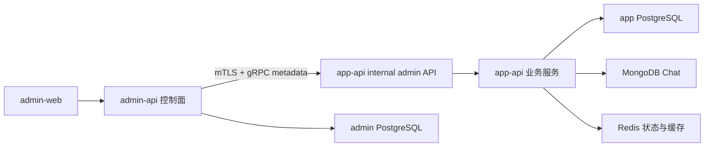
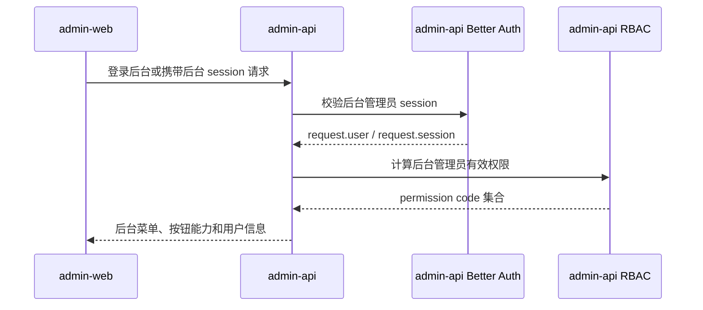
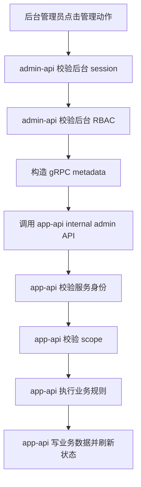
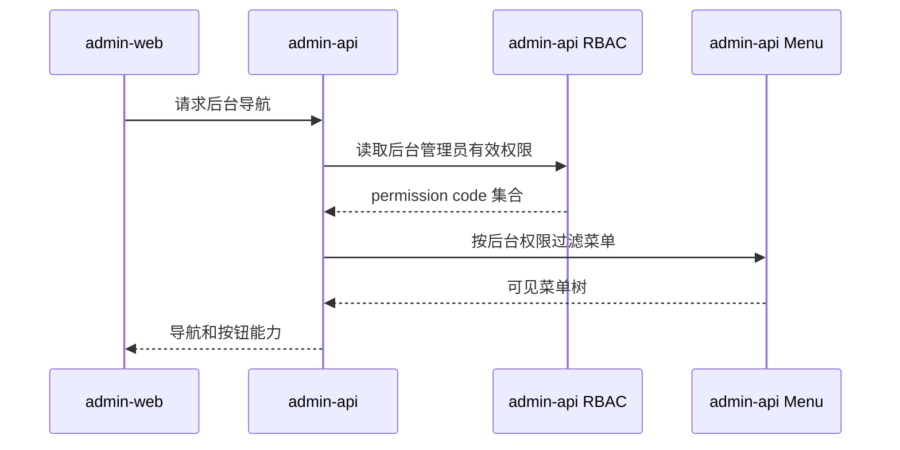
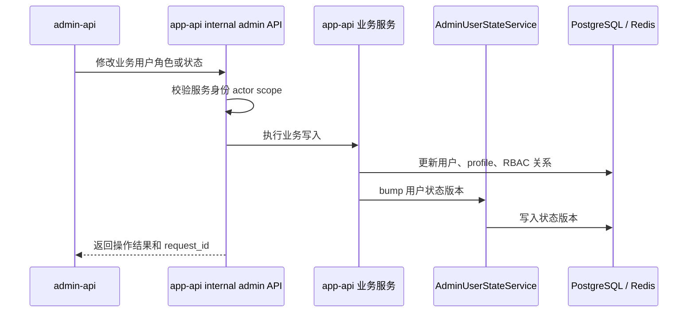
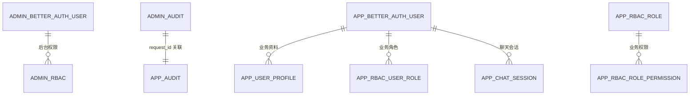

# app-admin 控制面管理说明

## 1. 标题与范围

本文定义 `admin-api` / `admin-web` 管理 `app-api` 的控制面边界、鉴权模型、审计模型和 `app-user-admin` 模块职责。

本文覆盖：

- `admin-web -> admin-api -> app-api` 的跨服务管理链路。
- `app-api` 内部管理 API 的服务身份、操作人身份、scope 与审计设计。
- `app-user-admin` gRPC 控制面在 `app-api` 内按业务域归档的职责边界。
- monorepo 在该方案中的共享职责。

本文不覆盖：

- `admin-web` 页面 UI 设计。
- 业务用户端普通 HTTP API 的完整权限模型。
- 具体 OAuth2 授权服务器或网关产品选型。

## 2. 依据代码清单

- `apps/app-api/src/main.ts`：`app-api` 同进程启动 HTTP `/app` 和 `app_user_admin` gRPC microservice，gRPC 使用 mTLS，缺 CA/cert/key 时启动失败。
- `apps/app-api/src/modules/app.module.ts`：`app-api` 聚合 Better Auth、Prisma、MongoDB、RBAC、用户状态、Chat 与 `AppUserAdminModule`。
- `apps/app-api/src/modules/app-user-admin/app-user-admin.module.ts`：集中注册按模块拆分后的 gRPC 控制面 controller 与共享 access service。
- `apps/app-api/src/modules/system/users/users-admin.grpc.controller.ts`、`apps/app-api/src/modules/system/users/users-admin.service.ts`：业务用户 CRUD、封禁/解封、密码重置、profile 与 RBAC 角色绑定。
- `apps/app-api/src/modules/better-auth/better-auth-admin.grpc.controller.ts`、`apps/app-api/src/modules/better-auth/better-auth-admin.service.ts`：Better Auth admin 用户、会话、伪装和权限检查。
- `apps/app-api/src/modules/better-auth/better-auth-internal-admin.service.ts`：`app-api` 进程内直接调用 Better Auth internal adapter 的管理能力。
- `apps/app-api/src/modules/system/menus/menus-policy.grpc.controller.ts`、`apps/app-api/src/modules/system/menus/menus-policy.service.ts`：角色菜单策略管理。
- `apps/app-api/src/modules/app-user-admin/app-user-admin-control-plane-access.service.ts`：`admin-api -> app-api` 控制面 gRPC metadata、actor、requestId 和 scope 校验。
- `apps/app-api/src/modules/better-auth/better-auth.module.ts`、`apps/app-api/src/modules/better-auth/better-auth.service.ts`、`apps/app-api/src/modules/better-auth/better-auth-options.ts`：`app-api` 自己的登录、session、Better Auth 插件和业务用户初始化逻辑。
- `apps/app-api/src/modules/user-state/admin-user-state.service.ts`：业务用户、角色、菜单变更后的状态版本刷新。
- `apps/app-api/src/modules/system/assignments/assignments.service.ts`、`apps/app-api/src/modules/system/rbac/rbac-authorization.service.ts`：`app-api` 内部业务用户 RBAC 关系维护和权限判断。
- `proto/app-user-admin.proto`：当前跨服务 gRPC contract。
- `libs/common/src/grpc/grpc-error.helpers.ts`：当前 gRPC request metadata 和错误 metadata 的公共封装。
- `apps/admin-api/src/modules/app.module.ts`：`admin-api` 是后台控制面后端，拥有自己的后台登录、RBAC、审计、任务和菜单体系。
- `apps/admin-web/src/api/index.ts`：`admin-web` 通过 `VITE_API_BASE_URL` 访问 `admin-api`，不应该直连 `app-api`。

## 3. 一句话总览

`admin-api` 是控制面，负责后台管理员登录、后台 RBAC、操作发起和控制面审计；`app-api` 是业务面，负责解释和修改自己的业务数据、执行业务规则、刷新状态版本并记录业务面审计。`admin-web` 只访问 `admin-api`，所有写入 `app-api` 的管理动作必须通过 `app-api` 内部管理 API 完成。

## 4. 总体架构图

## 5. 登录与会话构建流程

要点：

- 后台管理员身份只属于 `admin-api`。
- `app-api` 不应该接收浏览器里的后台 session，也不应该理解后台登录 cookie。
- `app-api` 只接收来自 `admin-api` 的服务间调用上下文。

## 6. 请求鉴权流程

服务间调用必须表达两层身份：

| 字段                | 含义                                     | 推荐来源                                 |
| ------------------- | ---------------------------------------- | ---------------------------------------- |
| `source_app`        | 调用服务主体，例如 `admin-api`         | gRPC metadata                            |
| `target_rpc_method` | 本次调用的 RPC 方法名                    | gRPC metadata                            |
| `actor.id`          | 真实后台管理员 ID，只用于审计和写入人    | `admin-api` 登录态                     |
| `scope`             | 本次调用允许的动作，例如 `app.user.ban` | `admin-api` 根据已通过的后台 RBAC 生成 |
| `request_id`        | 跨服务链路 ID                            | HTTP/gRPC metadata 透传                  |
| `reason`            | 操作原因                                 | 后台表单或系统生成                       |

## 7. 菜单过滤流程

要点：

- 后台菜单是否可见由 `admin-api` 决定。
- `app-api` 不参与后台菜单过滤。
- `app-api` 的菜单、角色和业务权限只服务业务端或业务资源判断。

## 8. 权限变更同步流程

要点：

- `admin-api` 不直接写 app 库业务表。
- `app-api` 自己维护业务数据一致性和状态版本。
- 报表读取使用只读副本、投影表或 analytics 数据库；报表通道不承载写操作。

## 9. 数据关系图

说明：

- `ADMIN_BETTER_AUTH_USER` 和 `APP_BETTER_AUTH_USER` 是两个身份域，不应共用一个“超级管理员用户”来跨域调用。
- `ADMIN_AUDIT` 记录控制面动作，`APP_AUDIT` 记录业务面实际变更，两者通过 `request_id`、`jti` 和资源 ID 串联。
- app 库数据只能由 `app-api` 解释和写入。

## 10. 边界与注意事项

### 10.1 不允许的反模式

- `admin-api` 直接写 app 库主业务表。
- `admin-web` 直连 `app-api` internal admin API。
- 在 `app-api` 内置一个给 `admin-api` 登录的业务超级管理员账号。
- 在 monorepo 中从 `admin-api` 直接 import `apps/app-api/src/**` 的业务 service。
- 让 `app-api` 理解 `admin-api` 的后台角色名并据此做最终授权。
- 只依赖“内网”而不校验服务身份、scope 和 request metadata。

### 10.2 允许的共享内容

- `proto/app-user-admin.proto`。
- DTO、Zod schema、错误码、scope 常量。
- 生成的 TypeScript client。
- 与业务无关的通用工具，例如 gRPC metadata、错误序列化、request id 透传。

### 10.3 服务间鉴权推荐等级

| 层级 | 方案 | 说明 |
| --- | --- | --- |
| 传输身份 | mTLS | `app-api` gRPC transport 强制使用服务端证书、客户端证书和 CA。 |
| 来源校验 | gRPC metadata | `AdminControlPlaneAccessService` 校验 `source_app`、`actor.id`、`request_id`、RPC method 与 scope。 |
| 操作审计 | actor + request_id + reason | admin-api 和 app-api 使用同一个 request id 串联控制面动作与业务面写入。 |

### 10.4 gRPC 控制面目录结构

当前 gRPC 代码按业务域归档，`app-user-admin` 只保留控制面共享装配与 access 校验：

| 目标职责                                   | 推荐承载                                |
| ------------------------------------------ | --------------------------------------- |
| 业务用户 gRPC 方法入口                     | `UserAdminGrpcController`               |
| Better Auth gRPC 方法入口                  | `BetterAuthAdminGrpcController`         |
| 菜单策略 gRPC 方法入口                     | `MenuPolicyGrpcController`              |
| 服务调用身份、actor、requestId、scope 校验 | `AppUserAdminControlPlaneAccessService` |
| 业务用户 CRUD、封禁、密码、角色绑定        | `UserAdminService`                      |
| Better Auth internal adapter 管理能力      | `BetterAuthInternalAdminService`        |
| Better Auth admin 用户、会话、伪装操作     | `BetterAuthAdminService`                |
| 菜单策略管理                               | `MenuPolicyService`                     |
| 状态版本刷新                               | `AdminUserStateService`                 |
| gRPC 错误序列化                            | `ShiroGrpcExceptionFilter`              |

### 10.5 Better Auth 管理调用定位

控制面请求通过 mTLS 与 gRPC metadata 完成跨服务身份校验后，由 `app-api` 进程内的 `BetterAuthInternalAdminService` 直接调用 Better Auth internal adapter / Prisma 完成用户、会话、密码和封禁管理。

## 11. 联调/回归用例

### 11.1 架构边界检查

- `admin-web` 只配置 `admin-api` API base URL。
- `admin-api` 不直接写 app 库业务表；写操作通过 `app-api` internal admin API。
- `app-api` internal admin API 仅在 mTLS 通过且 metadata 完整时可调用。
- `admin-api` 和 `app-api` 均记录同一个 `request_id`。

### 11.2 gRPC metadata 检查

- 请求必须带 `x-request-id`。
- 写操作必须带 `actor.id` 或等价 metadata。
- 写操作必须带对应 `scope`。
- 高危写操作必须带 `reason`。

### 11.3 业务用户管理回归

- 创建业务用户后 profile 初始化、默认角色绑定和状态版本刷新正确。
- 更新业务用户资料后主表、profile 和角色绑定一致。
- 封禁/解封后 Better Auth 主表状态和返回状态一致。
- 删除用户后用户状态版本刷新。
- 重置密码只通过 `app-api` 内部业务服务执行，不由 `admin-api` 直写数据库。

### 11.4 审计回归

- `admin-api` 控制面审计包含后台管理员、页面/接口、目标 app、scope、request_id。
- `app-api` 业务面审计包含调用服务、真实 actor、业务资源、改前改后、request_id、token_jti。
- 两边审计能通过 `request_id` 串联。
