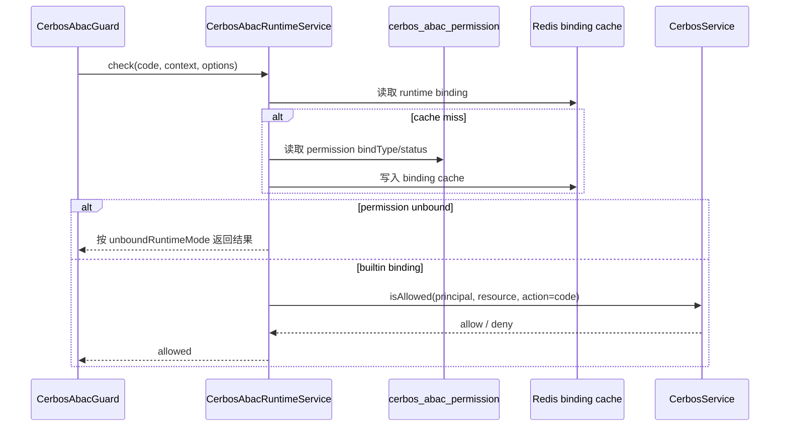

# cerbos-abac 共享库说明

## 1. 依据代码清单

- `libs/cerbos-abac/src/module.ts`
- `libs/cerbos-abac/src/decorator.ts`
- `libs/cerbos-abac/src/runtime.guard.ts`
- `libs/cerbos-abac/src/services/runtime.service.ts`
- `libs/cerbos-abac/src/services/control-plane.service.ts`
- `libs/cerbos-abac/src/services/compiler.service.ts`
- `libs/cerbos-abac/src/services/policy-validator.service.ts`
- `libs/cerbos-abac/src/services/publisher.service.ts`
- `libs/cerbos-abac/src/field-registry-utils.ts`
- `libs/cerbos-abac/src/types.ts`
- `prisma/admin/cerbos-abac.prisma`
- `prisma/app/cerbos-abac.prisma`

## 2. 一句话总览

`cerbos-abac` 是 admin-api 和 app-api 共用的 Cerbos ABAC 控制面与运行时库；控制面维护字段、策略组、手写策略、发布记录和审计，运行时通过 `@AbacPermission(code)` 与 `CerbosAbacGuard` 调用 Cerbos 判断。

## 3. 模块装配

`CerbosAbacModule.forRoot()` 接收：

- `appName`：参与 Redis runtime binding cache key。
- `cerbosEnvPrefix`：绑定对应前缀的 `CerbosModule` 服务。
- `prismaServiceToken`：应用侧 Prisma provider。
- `unboundRuntimeMode`：未绑定 permission code 的运行时策略，默认使用库常量。
- `runtimeBindingCacheTtlSeconds`：运行时绑定缓存 TTL。

模块导出 compiler、validator、publisher、control-plane、runtime service 和 guard。

## 4. 运行时鉴权流程

运行时规则：

- `CerbosAbacGuard` 只读取 handler 上的 `CERBOS_ABAC_PERMISSION_KEY`。
- 用户和角色来自对应 `CerbosModule.forRoot()` 的 `userFromContext`。
- principal attr 包含 session 快照和 `@AbacPermission()` 的 ext attr。
- resource id 默认取 `req.params.id`，没有时使用 `*`。
- bound permission 会为 principal roles 追加 ABAC runtime role。
- Redis cache 是优化提示，读取或写入失败时回数据库。

## 5. 控制面能力

`CerbosAbacControlPlaneService` 提供：

- health：统计 ABAC permission、策略组、手写策略和 active release。
- 字段注册表：列出、创建、更新、删除 ABAC 字段，并统计条件引用。
- RBAC 权限选项：从 `rbac_permission` 读取可绑定 code。
- 策略组：把 RBAC permission code 绑定到条件树，写入 `cerbos_abac_policy_group*` 表。
- 手写策略：校验完整 Cerbos policy，保存 resource、version 和 action codes。
- 编译预览、发布预览、发布、版本列表、回滚。
- 运行时测试：用原始 principal/resource 输入调用 runtime。

## 6. 数据边界

- `cerbos_abac_permission` 保存 ABAC permission code、RBAC 快照字段、bind type 和状态。
- `cerbos_abac_policy_group` 与 `cerbos_abac_condition_node` 保存内置条件树。
- `cerbos_manual_policy` 保存完整 Cerbos policy。
- `cerbos_abac_policy_release` 与 release snapshot 保存发布包。
- `cerbos_abac_audit_log` 记录控制面字段、策略、发布和删除动作。
- ABAC 表不回写 RBAC 表；RBAC permission 是可绑定选项和 action code 来源。

## 7. 回归检查

- 未声明 `@AbacPermission()` 的接口由 guard 放行。
- 已声明 code 但无 session 或角色时拒绝。
- 未绑定 code 的结果符合 `unboundRuntimeMode`。
- 策略组保存后会重新计算 permission bindType，并清理 runtime binding cache。
- 手写策略必须通过 Cerbos policy 校验后保存。
- 发布和回滚生成 release 记录并可被 health 返回。
