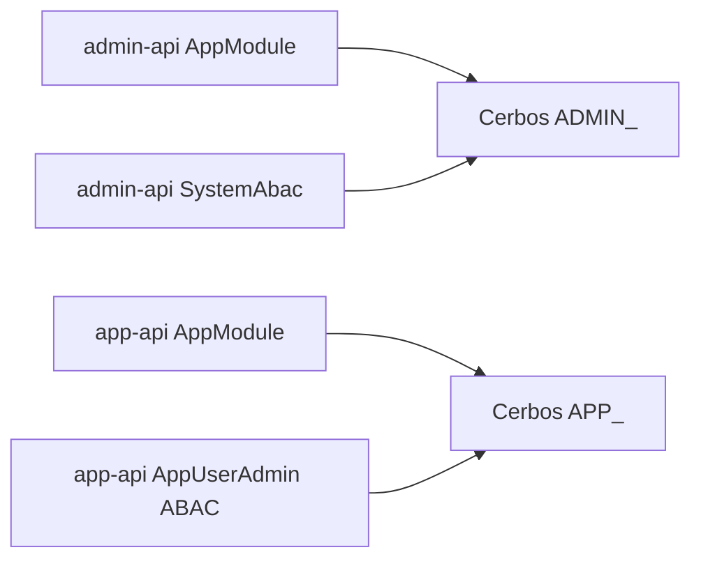
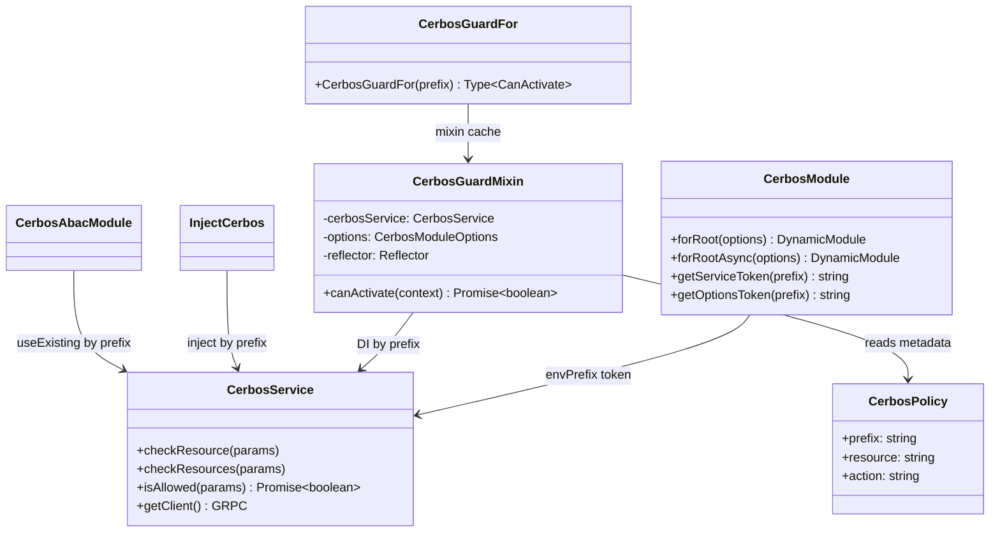
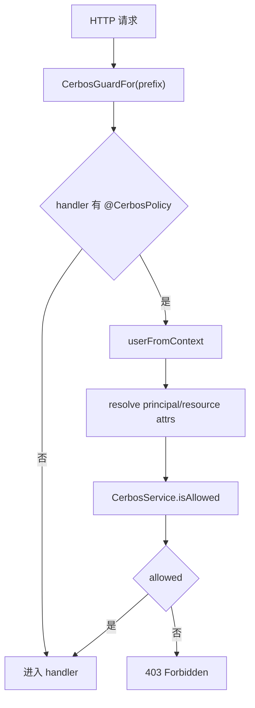
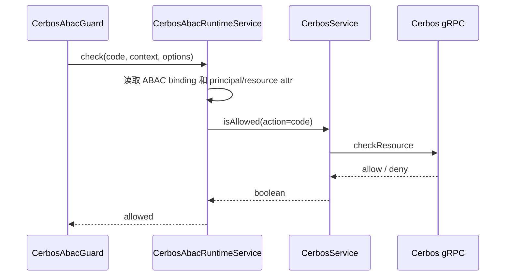

# cerbos 关系图

## 1. 建模说明

本图覆盖 `libs/cerbos` 当前运行链路：

- `CerbosModule` 通过 `envPrefix` 注册独立实例。
- `CerbosGuardFor(prefix)` 通过 DI 注入对应实例。
- `@CerbosPolicy()` 在 handler 上声明 resource/action/attr。
- `CerbosAbacModule` 通过同一 prefix 复用 Cerbos 实例。

## 2. 当前应用接线



说明：

- `ADMIN_` 服务 admin-api 的 Cerbos Policy 和 ABAC。
- `APP_` 服务 app-api 的 Cerbos Policy 和 ABAC。
- 两个实例使用独立环境变量前缀和 provider token。

## 3. 类图



## 4. 普通 HTTP 鉴权流程



## 5. ABAC 复用流程



## 6. 配置关系

```text
admin-api
  -> ADMIN_CERBOS_ENDPOINT
  -> ADMIN_CERBOS_TLS_*
  -> CerbosService[ADMIN_]

app-api
  -> APP_CERBOS_ENDPOINT
  -> APP_CERBOS_TLS_*
  -> CerbosService[APP_]
```

## 7. 回归检查

- `CerbosGuardFor('ADMIN_')` 注入 `ADMIN_` 实例。
- `CerbosGuardFor('APP_')` 注入 `APP_` 实例。
- 没有 `@CerbosPolicy()` 的 handler 放行。
- `@CerbosPolicy()` 缺 prefix 时在装饰器阶段报错。
- ABAC 模块按 `cerbosEnvPrefix` 复用正确实例。
