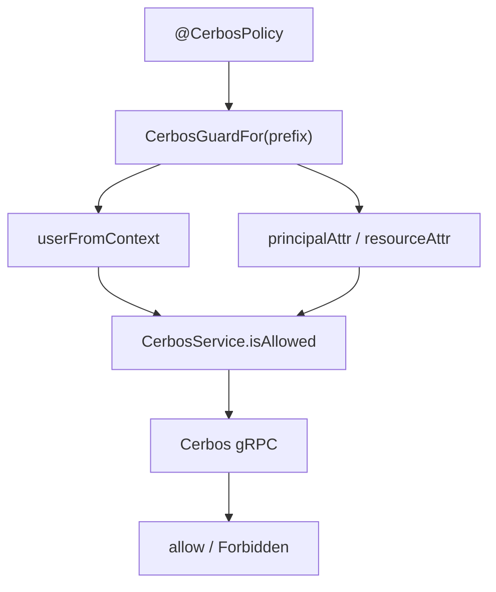

# cerbos 共享库说明

## 1. 依据代码清单

- `libs/cerbos/cerbos.module.ts`
- `libs/cerbos/cerbos.service.ts`
- `libs/cerbos/cerbos.guard.ts`
- `libs/cerbos/cerbos.decorator.ts`
- `libs/cerbos/cerbos.interface.ts`
- `apps/admin-api/src/modules/app.module.ts`
- `apps/app-api/src/modules/app.module.ts`
- `libs/cerbos-abac/src/module.ts`

## 2. 一句话总览

`libs/cerbos` 提供按环境变量前缀隔离的 Cerbos gRPC 客户端、策略装饰器、Guard 工厂和注入装饰器；admin-api 注册 `ADMIN_` 实例，app-api 注册 `APP_` 实例，Cerbos ABAC 通过同一前缀复用对应实例。

## 3. 模块注册

`CerbosModule.forRoot(options)` 与 `CerbosModule.forRootAsync(options)` 都要求显式 `envPrefix`。

| 能力 | 说明 |
| --- | --- |
| `getCerbosServiceToken(prefix)` | 生成指定前缀的 `CerbosService` provider token。 |
| `getCerbosOptionsToken(prefix)` | 生成指定前缀的 options provider token。 |
| `@InjectCerbos(prefix)` | 在 service 构造函数中注入指定前缀的 Cerbos 实例。 |
| `CerbosGuardFor(prefix)` | 为指定前缀创建绑定实例的 Nest Guard。 |

当前应用接线：

- `admin-api`：`CerbosModule.forRoot({ envPrefix: 'ADMIN_', userFromContext })`
- `app-api`：`CerbosModule.forRoot({ envPrefix: 'APP_', userFromContext })`
- `cerbos-abac`：通过 `cerbosEnvPrefix` 引用同一前缀的 `CerbosService` 和 options。

## 4. CerbosService

`CerbosService` 通过 `envPrefix` 拼接配置项：

- `{PREFIX}CERBOS_ENDPOINT`
- `{PREFIX}CERBOS_TLS_ENABLED`
- `{PREFIX}CERBOS_TLS_CA_PATH`
- `{PREFIX}CERBOS_TLS_CLIENT_CERT_PATH`
- `{PREFIX}CERBOS_TLS_CLIENT_KEY_PATH`
- `{PREFIX}CERBOS_TLS_SERVER_NAME`
- `{PREFIX}CERBOS_STARTUP_HEALTH_CHECK_ENABLED`
- `{PREFIX}CERBOS_ADMIN_USERNAME`
- `{PREFIX}CERBOS_ADMIN_PASSWORD`

核心方法：

- `checkResource()`：检查单个资源的多个 action。
- `checkResources()`：批量检查多个资源。
- `isAllowed()`：检查单个 action，返回 boolean。
- `getClient()`：返回底层 `@cerbos/grpc` client，供控制面能力调用。

启动时会根据 TLS 配置创建 secure context，并按实例配置执行 Cerbos health check。配置项缺失、布尔值非法或证书文件不存在时直接抛错。

## 5. Guard 与装饰器

规则：

- `@CerbosPolicy({ prefix, resource, action })` 必须显式提供 prefix。
- 没有 `@CerbosPolicy()` 的 handler 由 `CerbosGuardFor(prefix)` 放行。
- `userFromContext()` 返回登录用户时，roles 不能为空。
- 未登录用户按 `anonymous` + `guest` 进入 Cerbos，由策略决定是否放行。
- resource id 默认使用 `req.params.id`，没有时使用 `*`。
- 资源属性来自 `resourceAttr`，principal 属性优先来自装饰器，其次来自模块 options 的 `principalAttrFromContext`。
- 角色展开由调用方在 `userFromContext` 中完成，Guard 直接使用传入 roles。

## 6. 与 RBAC / ABAC 的边界

- RBAC 基础授权由 `RbacGuard` 和 RBAC effective 读模型完成。
- Cerbos Guard 只读取 `CERBOS_POLICY_KEY`，不读取 RBAC metadata、菜单表或 SpiceDB tuple。
- Cerbos ABAC 使用 `CerbosAbacRuntimeService` 读取 ABAC 绑定，再调用当前前缀的 `CerbosService.isAllowed()`。
- `getClient()` 暴露 Cerbos 原生 client；业务代码使用它时仍要保持各自控制面或 service 边界。

## 7. 回归检查

- `envPrefix` 为空时模块注册、注入和 Guard 工厂直接报错。
- TLS 开启时 CA、client cert、client key 都必须存在。
- health check 开启时 Cerbos 必须返回 `SERVING`。
- 无 `@CerbosPolicy()` 的 handler 放行。
- 有策略声明但 Cerbos 返回 deny 时抛 Forbidden。
- ABAC 模块按 `cerbosEnvPrefix` 注入同一前缀实例。

## 8. 相关文档

- 关系图：`cerbos-module-class-diagram.md`
- Cerbos ABAC：`../../cerbos-abac/docs/cerbos-abac.md`
