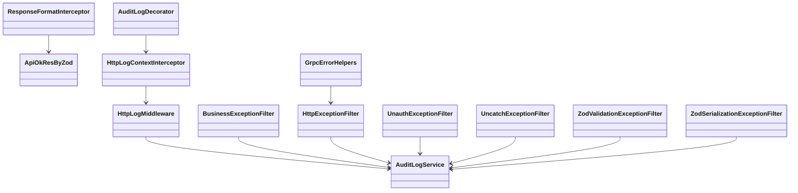
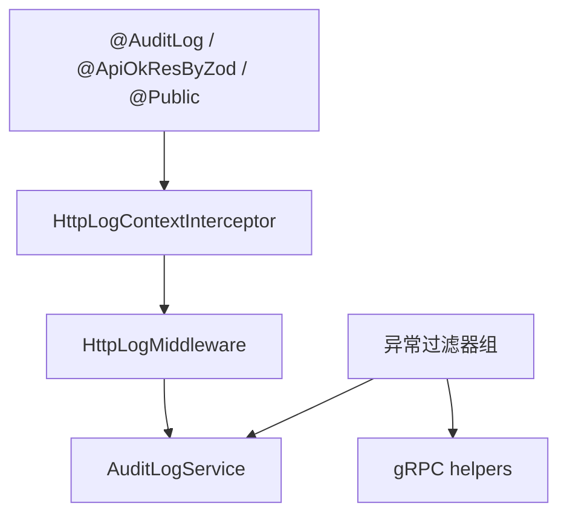
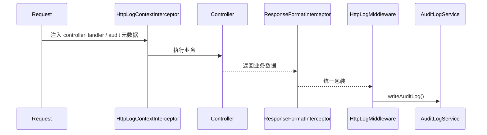
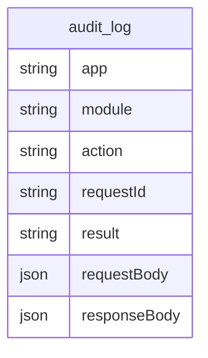

# common 关系图

## 1. 建模说明
本图只画当前两个应用确实使用到的公共能力：请求日志、审计日志、统一响应、异常归一和 gRPC 错误传输。

## 2. 模块分层结论
- `decorators` 定义声明式元数据。
- `interceptors` 与 `middleware` 负责运行期上下文收集。
- `filters` 负责错误出口统一。
- `logger` 负责最终落库。
- `grpc helpers` 负责跨服务传输一致性。

