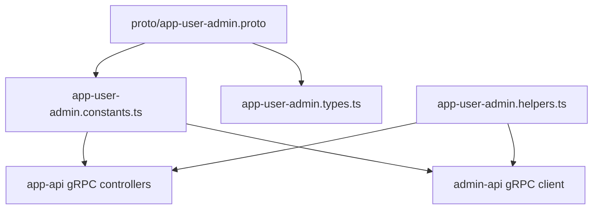

# app-api 管理控制面 gRPC 合同

## 范围

本文档描述 `admin-api -> app-api` 管理控制面 gRPC 合同。合同入口使用 `proto/app-user-admin.proto` 文件和 `app_user_admin` package，按模块 service 拆分，RBAC 管理请求使用具名 message。

## 模块 Service

当前 proto 拆成 8 个模块 service，共 72 个 RPC：

| Service | RPC 数量 | 责任 |
| --- | ---: | --- |
| `AppBusinessUserAdmin` | 10 | 业务用户与业务角色管理 |
| `AppBetterAuthAdmin` | 14 | Better Auth 管理 API |
| `AppRoleMenuPolicyAdmin` | 3 | 角色菜单策略控制面 |
| `AppRbacRoleAdmin` | 14 | app-api RBAC role |
| `AppRbacUserGroupAdmin` | 10 | app-api RBAC user-group |
| `AppRbacPermissionAdmin` | 9 | app-api RBAC permission |
| `AppRbacPermissionGroupAdmin` | 6 | app-api RBAC permission-group |
| `AppRbacMenuAdmin` | 6 | app-api RBAC menu |

## 控制面校验

app-api gRPC transport 使用 mTLS，`ServerCredentials.createSsl(..., true)` 要求客户端证书。应用层仍强制校验 metadata：

- `sourceApp` 必须是允许的控制面来源，默认 `admin-api`
- `actorId` 必须存在，仅用于审计、日志和 `createdBy/updatedBy`
- `requestId` 必须存在
- `targetRpcMethod` 必须声明在 `APP_USER_ADMIN_RPC_SCOPE_MAP`
- `scopes` 必须包含该 RPC 对应 scope

admin 侧负责用户权限决策；app-api 不把 admin 用户权限重新映射到 app 内 RBAC permission。

## RBAC Typed Contract

RBAC RPC 使用具名 request/response message，例如：

- `RbacRoleListRequest -> RbacRoleListResponse`
- `RbacRoleMutationRequest -> RbacRoleMessage`
- `RbacUserGroupMembersRequest -> RbacUserRelationListResponse`
- `RbacPermissionDeclarationBoardResponse`
- `RbacMenuMutationRequest -> RbacMenuMessage`

显式置空通过 `clearXxx = true` 表达。客户端使用 `toRbacGrpcRequest()` 把 HTTP DTO 的 `null` 编码为 `clearXxx = true`，服务端使用 `fromRbacGrpcRequest()` 还原为业务 service 的 `field: null` 语义。

## 共享常量

- `APP_USER_ADMIN_GRPC_PACKAGE = 'app_user_admin'`
- `APP_BUSINESS_USER_ADMIN_GRPC_SERVICE_NAME = 'AppBusinessUserAdmin'`
- `APP_BETTER_AUTH_ADMIN_GRPC_SERVICE_NAME = 'AppBetterAuthAdmin'`
- `APP_ROLE_MENU_POLICY_ADMIN_GRPC_SERVICE_NAME = 'AppRoleMenuPolicyAdmin'`
- `APP_RBAC_ROLE_ADMIN_GRPC_SERVICE_NAME = 'AppRbacRoleAdmin'`
- `APP_RBAC_USER_GROUP_ADMIN_GRPC_SERVICE_NAME = 'AppRbacUserGroupAdmin'`
- `APP_RBAC_PERMISSION_ADMIN_GRPC_SERVICE_NAME = 'AppRbacPermissionAdmin'`
- `APP_RBAC_PERMISSION_GROUP_ADMIN_GRPC_SERVICE_NAME = 'AppRbacPermissionGroupAdmin'`
- `APP_RBAC_MENU_ADMIN_GRPC_SERVICE_NAME = 'AppRbacMenuAdmin'`
- `APP_USER_ADMIN_PROTO_FILE = 'app-user-admin.proto'`

## Loader 规则

```ts
{
  keepCase: false,
  longs: String,
  enums: String,
  defaults: false,
  arrays: true,
  oneofs: true
}
```

`keepCase: false` 使 proto 的 `snake_case` 在 TypeScript 侧映射成 `camelCase`。`defaults: false` 保留“未传”的语义，`arrays: true` 让 repeated 字段稳定为数组。

## 接入图



## 注意事项

- `BusinessRoleMessage.role_ids` 语义是 `rbac_role.id`。
- `UpdateAdminUserRequest.data_json` 是 JSON 字符串，不是 RBAC 控制面的动态 payload。
- `StringPatch` 仍用于业务用户字段的显式置空。
- RBAC typed request 的 `clearXxx` 字段只表达显式置空，不用于权限校验。

