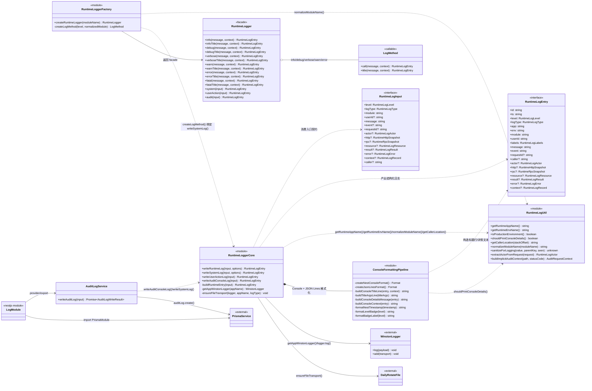
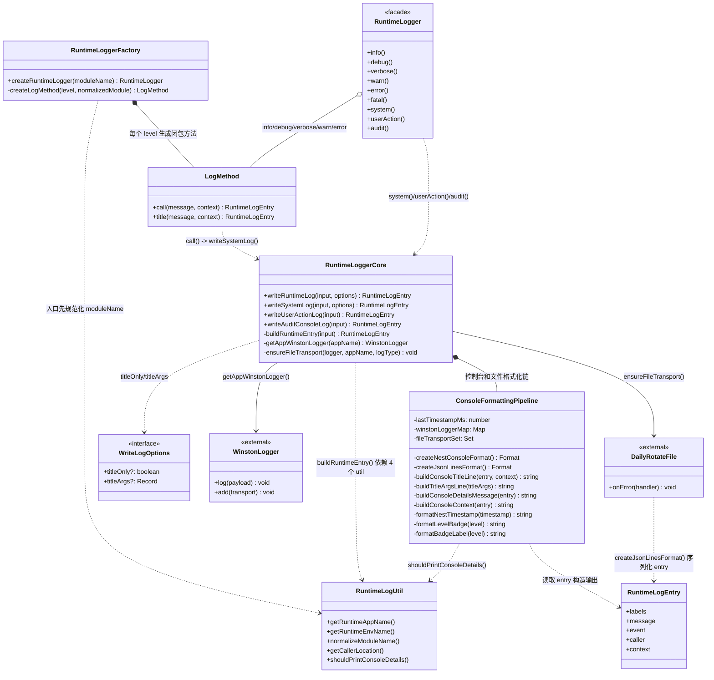
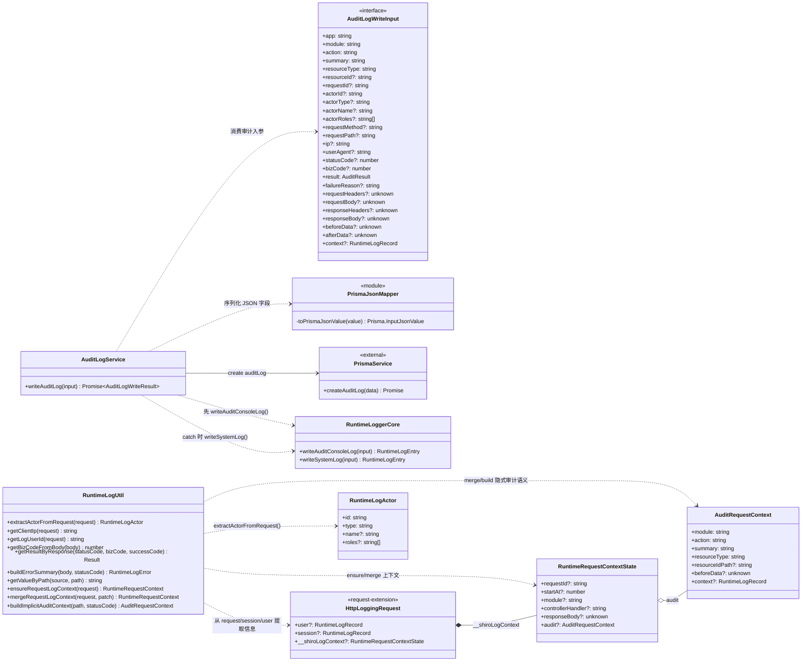
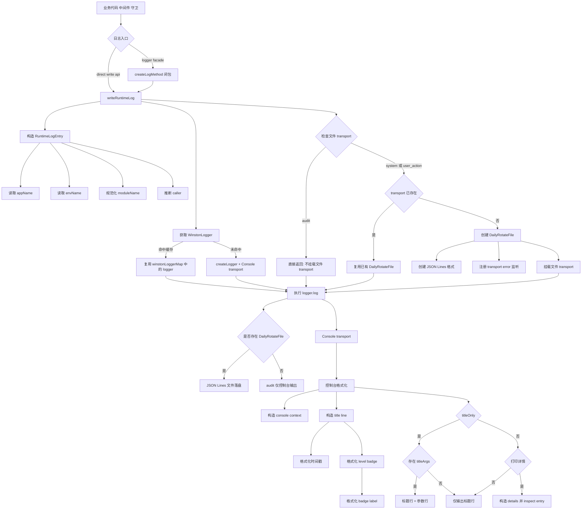
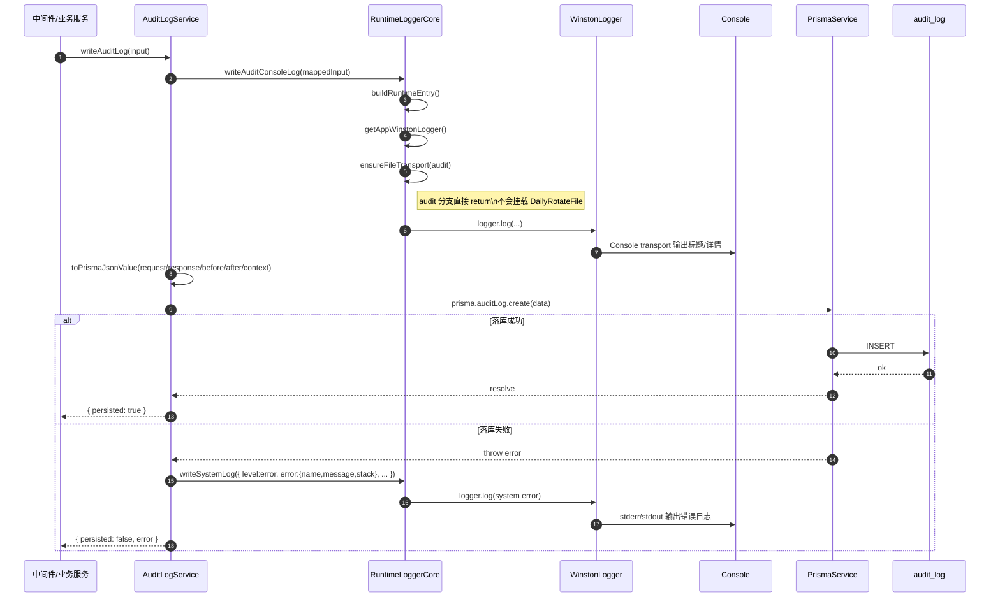
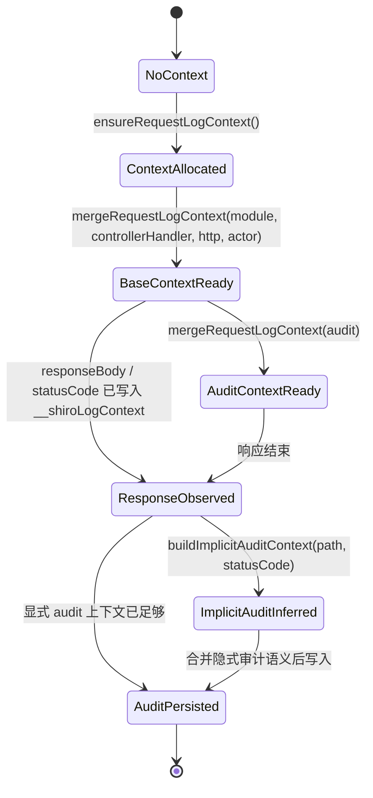

# Logger 模块关系类图

## 建模说明

- `logger` 模块并不是传统面向对象设计，核心实现以 `runtime-logger.ts` 和 `runtime-log.util.ts` 的顶层函数为主。
- 为了用 Mermaid `classDiagram` 深入表达“方法级调用关系”，本文将这两个函数模块分别抽象为 `RuntimeLoggerCore`、`ConsoleFormattingPipeline`、`RuntimeLogUtil` 等伪类。
- 图中的 `*Title()` 方法，对应真实代码中的 `logger.<level>.title()` 变体；这里用可读的类图命名来表达闭包返回值上的附加方法。

## 模块分层结论

- `runtime-log.types.ts` 定义了整个日志域模型，`RuntimeLogInput` 是入口契约，`RuntimeLogEntry` 是最终落盘和控制台输出契约。
- `runtime-logger.ts` 是日志引擎主干，负责构造日志实体、组织控制台格式化链路、缓存 Winston 实例、挂载按日轮转文件输出，并暴露纯函数式 logger facade。
- `runtime-log.util.ts` 是横切能力层，负责环境判断、调用位置、请求上下文管理、用户/角色提取、敏感字段脱敏、隐式审计上下文推断。
- `AuditLogService` 是模块里唯一真实的业务服务类，承担“审计日志双写”职责：先输出 `audit` 控制台日志，再尝试写 `auditLog` 表，失败时回写 `system` 错误日志。
- `LogModule` 只是 NestJS 的 DI 封装壳，真正的日志运行时入口并不依赖 DI，而是 `createRuntimeLogger()` 返回的闭包式接口。

## 总体关系类图

## 运行时日志主链路类图

### 主链路方法解读

- `createRuntimeLogger()` 先执行 `normalizeModuleName()`，然后把同一个 `normalizedModule` 关闭在五个级别方法和三个手动写入方法里，因此 facade 本身不保留状态对象，只保留闭包上下文。
- `createLogMethod()` 生成的普通方法会调用 `writeSystemLog()` 输出完整日志；`title()` 变体则通过 `WriteLogOptions.titleOnly=true` 走同一条底层管线，让 `createNestConsoleFormat()` 跳过 detail 部分，并把传入的 context 放到标题行下方，以同级别颜色的 `▶` 标记成紧凑参数行。
- `writeRuntimeLog()` 是唯一真正的写入口，它先 `buildRuntimeEntry()`，再基于 `entry.app` 取缓存中的 Winston logger，然后按 `entry.logType` 决定是否挂载 `DailyRotateFile`。
- `ensureFileTransport()` 的关键分支是 `audit` 直接返回，因此 `audit` 在运行时架构里天生只走控制台 transport，不进入文件落盘。
- `buildConsoleTitleLine()` 维护 `lastTimestampMs`，这意味着 `+Xms` 是“进程内最近一次控制台日志之间的差值”，不是 request 维度耗时。
- `buildConsoleDetailsMessage()` 只在 `shouldPrintConsoleDetails()` 返回 true 时输出 `inspect(consoleDetails)`；其中 `user_action` 会先裁剪成摘要对象，`system / audit` 仍保留完整结构，因此开发态也不会被大体积 HTTP 明细刷屏。

## 审计落库与请求上下文类图

### 审计与上下文方法解读

- `AuditLogService.writeAuditLog()` 并不是“先入库后输出”，而是“先控制台、后落库、失败再补 system 错误日志并返回 `{ persisted: false, error }`”，这样即使数据库异常，审计动作本身仍至少会进入运行时控制台，调用方也能显式看到落库失败。
- `toPrismaJsonValue()` 很薄，只做 `undefined` 剪枝，不做额外转换；因此 `AuditLogWriteInput` 中对象结构的可序列化性必须由上游保证。
- `extractActorFromRequest()` 优先使用 `request.session.user` 和 `request.session.roles`，`request.user` 用于补充日志或审计上下文。
- `ensureRequestLogContext()` 确保 request 上存在上下文对象；`mergeRequestLogContext()` 是唯一的渐进式写入口。中间件把这同一份对象放入 ALS，拦截器继续写 request，logger 从 ALS 读到的就是同一个引用。
- `buildImplicitAuditContext()` 采用正则规则表 `AUDIT_PATH_RULES` 做路径语义识别，避免 `includes()` 带来的误命中；401/403 则统一推断为 `security.deny` 型审计事件。

## 运行时写日志流程图

### 流程图解读

- `createLogMethod()` 不是直接写日志，而是把 `level + normalizedModule` 预绑定到闭包里，最后仍收敛到 `writeRuntimeLog()`。
- 入口先构造 `RuntimeLogEntry`，后选择 transport；因此控制台输出和文件落盘看到的是同一份结构化对象，而不是两套平行拼装逻辑。
- `ensureFileTransport()` 的分支决定了 `audit` 日志和 `system/user_action` 日志在 IO 层的根本分流。
- 控制台格式化链又被拆成“上下文拼装”“标题行拼装”“详情补充”三个层次，避免所有展示逻辑都塞进一个 `printf` 回调。

## 审计日志时序图

### 时序图解读

- `AuditLogService` 把“审计动作发生”与“数据库是否可用”拆开处理，先输出控制台，再尝试持久化，所以失败场景不会丢掉全部痕迹。
- `audit` 类型故意绕过文件 transport，这让审计日志的“结构化持久化责任”完全落在数据库层，而不是 Loki 文件层。
- catch 分支没有再次抛错，而是补写带 `error.name/message/stack/code` 的 `system` 错误日志，并通过返回值暴露失败；这意味着审计系统失败不会反向打断主业务流，但也不会只靠字符串上下文静默隐藏。

## 请求日志上下文状态图

### 状态图解读

- `__shiroLogContext` 不是一次性构造完成的，而是随着请求处理过程逐步补全，因此适合用状态图表达，而不是只看一个类型定义。
- `mergeRequestLogContext()` 对 `audit / actor / http / extra` 做浅合并；`audit.context` 会单独合并，避免覆盖已有审计扩展字段。
- 显式审计上下文不足时，根据路径和状态码走 `buildImplicitAuditContext()`，从 HTTP 事实推断审计语义。

## 日志生命周期甘特图

> 这张图表达的是“阶段先后关系”，不是实际 wall-clock 监控耗时。

```mermaid
gantt
    title 单次日志写入的生命周期
    dateFormat X
    axisFormat %L

    section 通用主链路
    入口调用                     :done, t1, 0, 1
    buildRuntimeEntry            :done, t2, after t1, 1
    获取或创建 WinstonLogger     :done, t3, after t2, 1
    判定并挂载 File Transport    :done, t4, after t3, 1
    logger.log 分发              :done, t5, after t4, 1

    section 控制台链路
    buildConsoleContext          :done, t6, after t5, 1
    buildConsoleTitleLine        :done, t7, after t6, 1
    titleOnly 判定               :done, t8, after t7, 1
    开发环境追加 inspect(consoleDetails)  :active, t9, after t8, 1

    section 文件链路
    system/user_action 落 JSONL  :done, t10, after t5, 1
    audit 跳过文件写入           :crit, t11, after t5, 1

    section 审计扩展链路
    AuditLogService 控制台审计输出 :done, t12, after t1, 1
    Prisma auditLog.create           :done, t13, after t12, 1
    落库失败补写 system error      :crit, t14, after t13, 1
```

### 甘特图解读

- 甘特图在这里不是项目排期图，而是把一次日志写入拆成串并行阶段，便于看清 `console`、`file`、`audit db` 三条时间上并存的子链路。
- `t10` 与 `t11` 是互斥语义：`system/user_action` 进入 JSON Lines，`audit` 则在同一阶段被明确排除。
- `AuditLogService` 的数据库链路与核心 `logger.log()` 并不是同一个 transport 体系，所以单独放成一段扩展生命周期更准确。

## 关键设计观察

- 这是一个“函数式日志引擎 + 单一 DI 服务”的混合模块，不是重服务类架构，因此分析重点必须落在函数调用链和闭包关系，而不是只看 `AuditLogService` 一个类。
- `sanitizeForLogging()` 可供中间件/过滤器提前处理大对象，也会在 `buildRuntimeEntry()` 写入边界统一处理，确保最终 entry 能安全 JSON 化。
- `winstonLoggerMap` 与 `fileTransportSet` 形成双缓存：前者避免重复创建 Console transport，后者避免同一个 `app + logType` 重复注册 DailyRotateFile。
- `RuntimeLogger` facade 暴露 `fatal` 级别，并与 `error` 一样走 stderr；需要完整结构时仍可使用 `writeSystemLog()` / `writeRuntimeLog()`。

