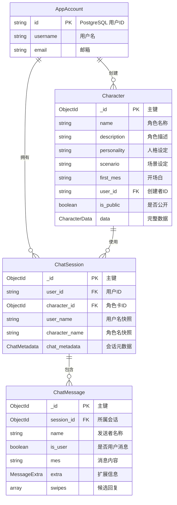
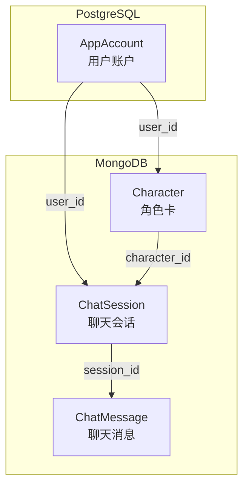
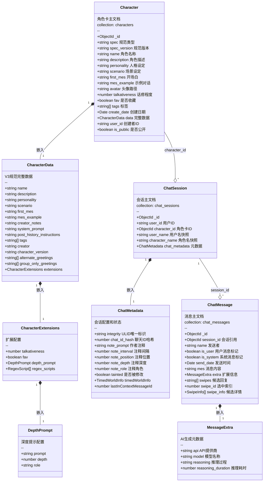
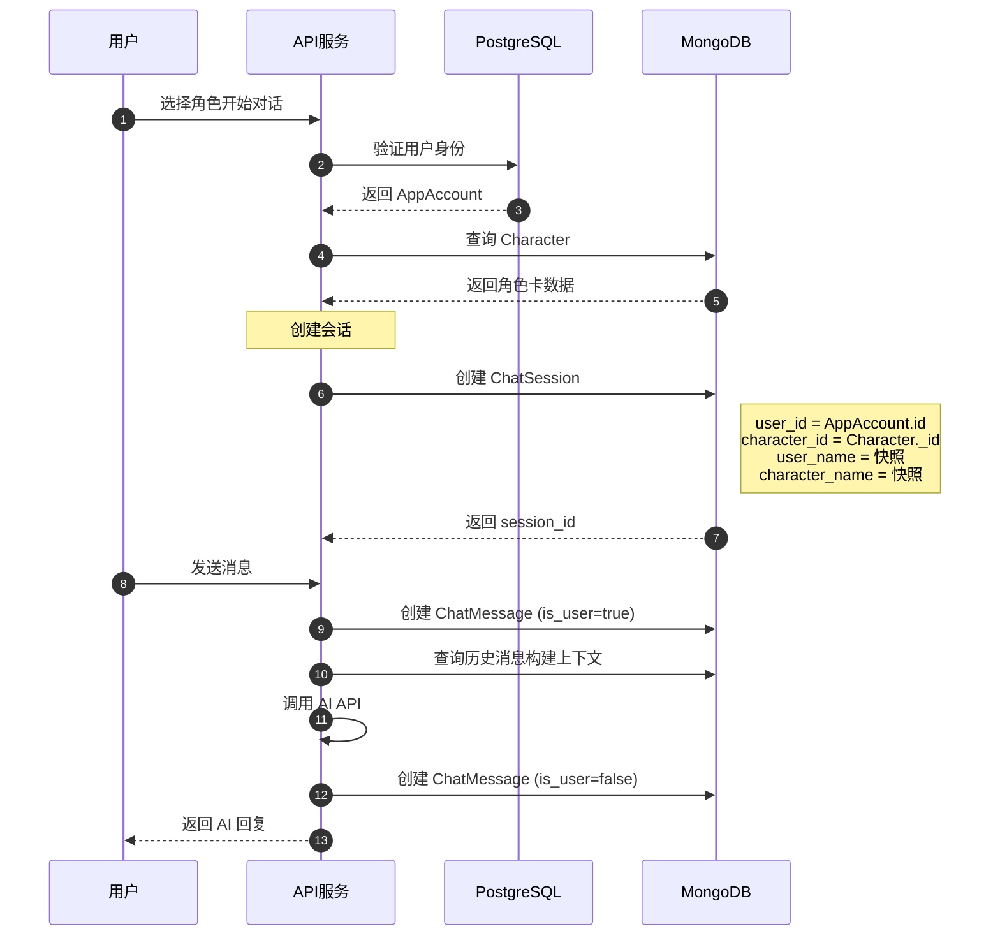
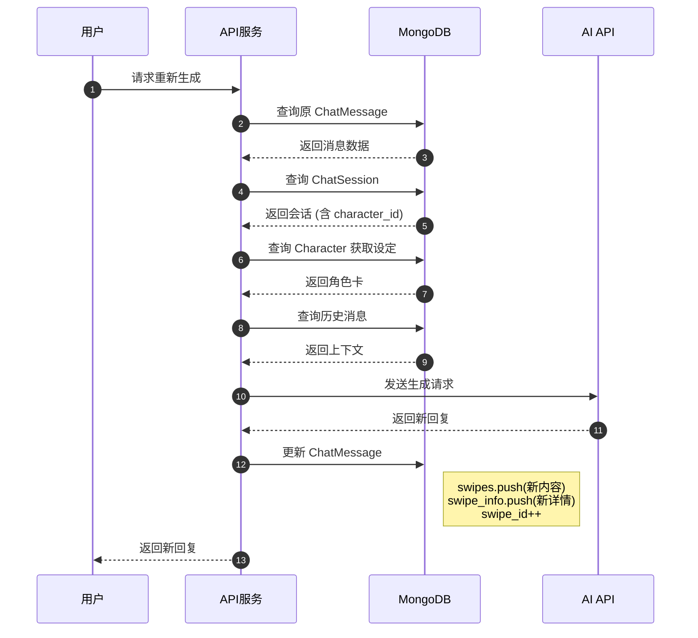
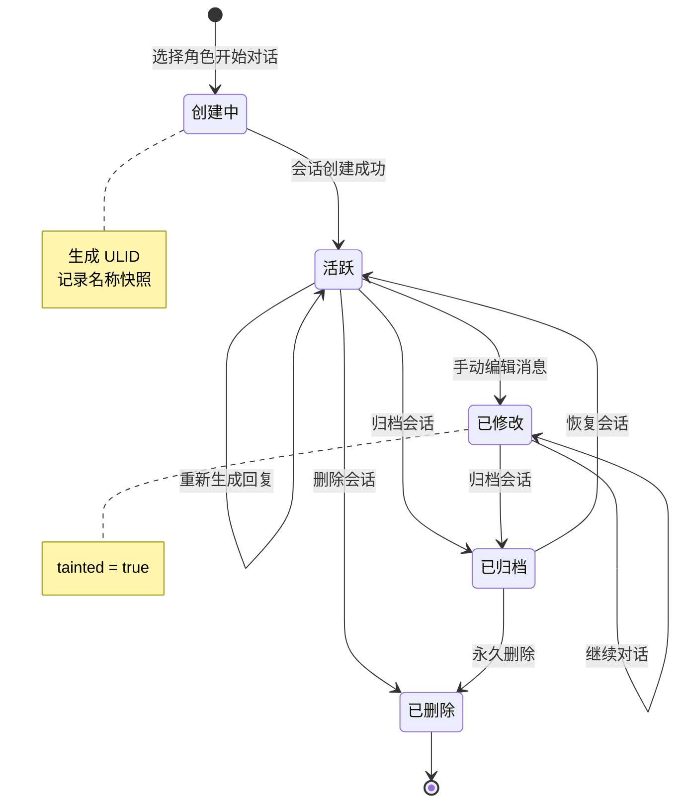
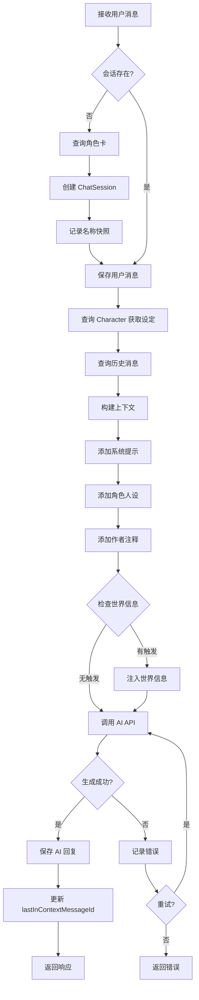
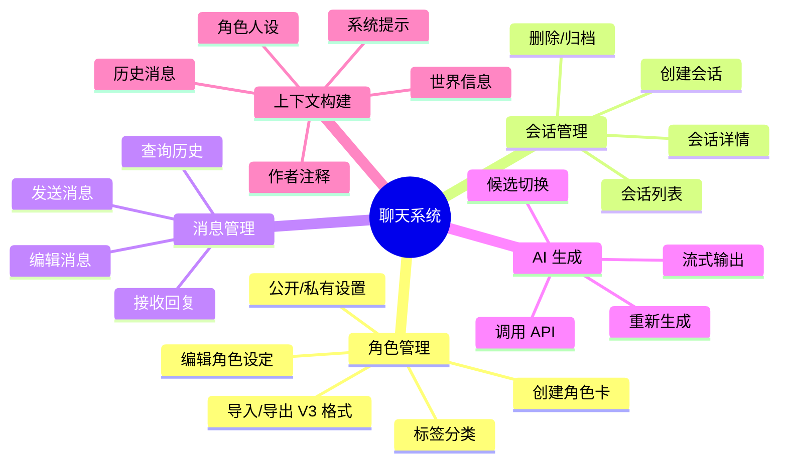
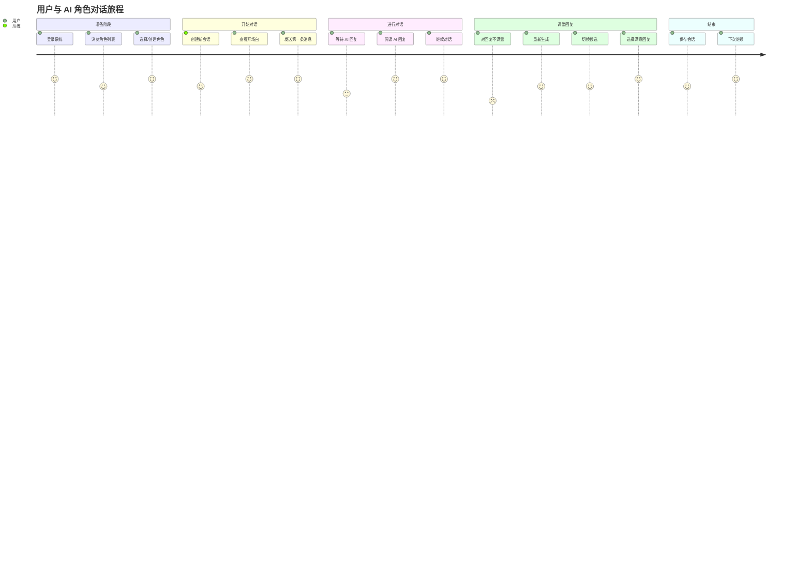

# Chat Schema 关系图

本文档描述了聊天系统的 MongoDB 数据模型，用于存储 AI 角色扮演对话。

## 概述

聊天系统由三个主要集合组成：
- **Character**: 存储 AI 角色卡的完整设定
- **ChatSession**: 存储会话级别的配置和元数据
- **ChatMessage**: 存储具体的对话消息

同时与 PostgreSQL 的用户系统关联。

## 实体关系图

## 跨数据库关系图

## 类图 - 嵌入文档结构

## 索引说明

### Character 集合

| 索引字段 | 类型 | 用途 |
|----------|------|------|
| name, data.description | text | 全文搜索角色 |
| user_id | normal | 查询用户创建的角色 |
| tags | normal | 按标签筛选 |
| is_public, createdAt | compound | 公开角色列表排序 |

### ChatSession 集合

| 索引字段 | 类型 | 用途 |
|----------|------|------|
| chat_metadata.integrity | unique | 通过 ULID 定位唯一会话 |
| user_id | normal | 查询用户的所有会话 |
| character_id | normal | 查询角色的所有会话 |
| user_id, character_id | compound | 查询用户与特定角色的会话 |

### ChatMessage 集合

| 索引字段 | 类型 | 用途 |
|----------|------|------|
| session_id, send_date | compound | 按时间顺序获取会话消息 |
| session_id, is_user | compound | 筛选会话中的用户或AI消息 |

## 时序图 - 创建会话并发送消息

## 时序图 - 重新生成回复

## 状态图 - 会话生命周期

## 流程图 - 消息处理流程

## 思维导图 - 系统功能模块

## 用户旅程图

