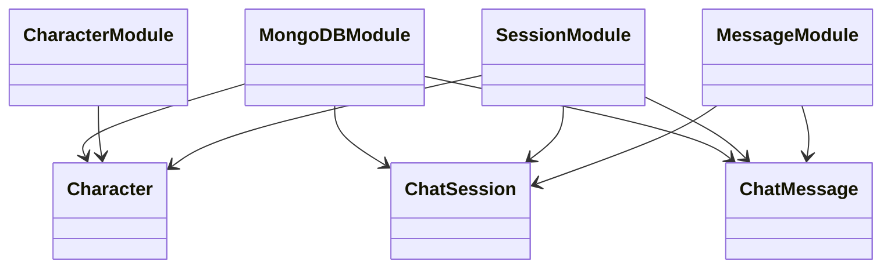
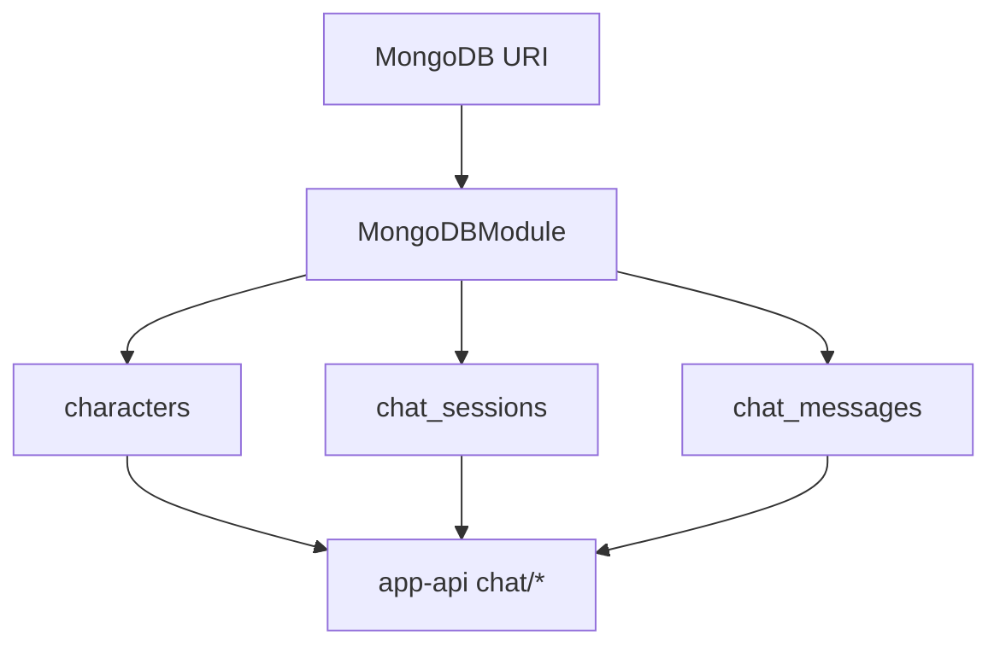
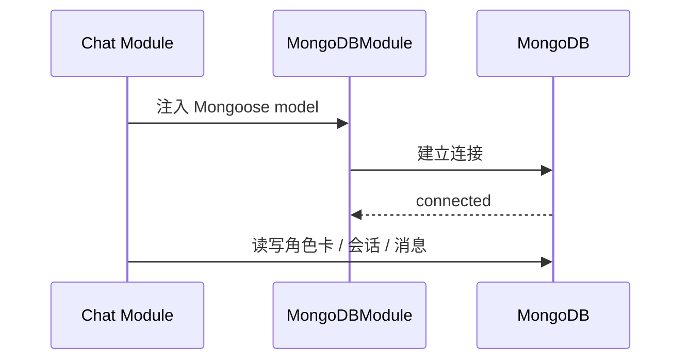
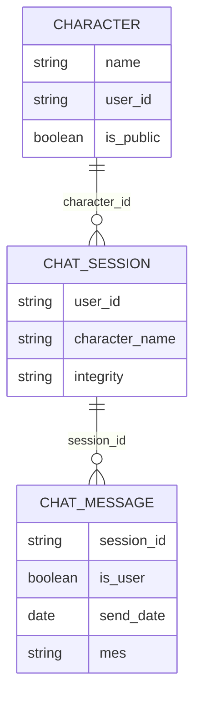

# mongodb 关系图

## 1. 建模说明
当前仓库只有聊天域使用 MongoDB，因此本图只画三套聊天 schema 与注入关系。

## 2. 模块分层结论
- `MongoDBModule` 管理连接。
- `Character`、`ChatSession`、`ChatMessage` 为聊天域三张核心集合。
- `app-api/chat/*` 三个子模块按需消费这些 schema。

