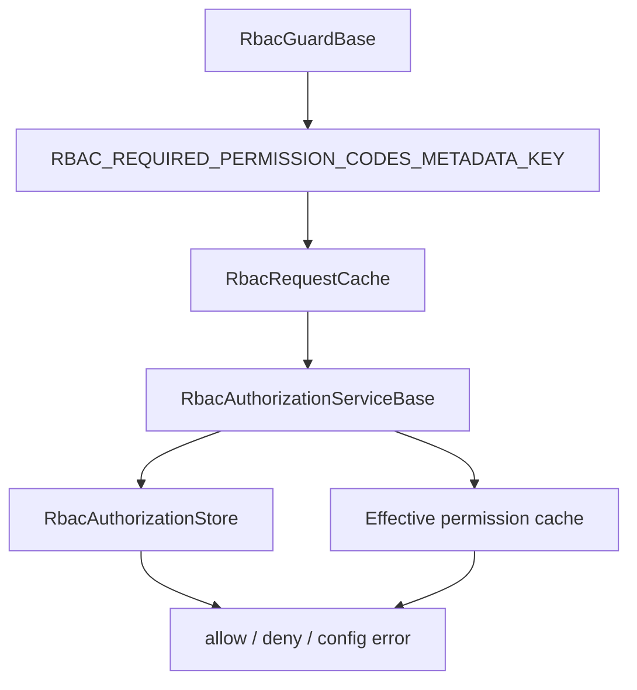

# rbac-core 共享库说明

## 1. 依据代码清单

- `libs/rbac-core/src/index.ts`
- `libs/rbac-core/src/runtime/rbac-permission.metadata.ts`
- `libs/rbac-core/src/runtime/rbac-permission.decorator.ts`
- `libs/rbac-core/src/runtime/rbac-request-cache.ts`
- `libs/rbac-core/src/runtime/rbac-guard.ts`
- `libs/rbac-core/src/runtime/rbac-authorization.service.ts`
- `libs/rbac-core/src/runtime/rbac-effective-permission-cache.service.ts`
- `libs/rbac-core/src/graph/rbac-graph.engine.ts`

## 2. 一句话总览

`rbac-core` 是 admin-api 和 app-api 共享的 RBAC 运行时库；它只提供 metadata、Guard/Authorization 基类、请求缓存、跨请求 effective permission cache 基类和纯图计算，不直接访问 Prisma、Redis 或 Nest 应用模块。

## 3. 运行时组件

| 文件 | 职责 |
| --- | --- |
| `rbac-permission.metadata.ts` | 定义 RBAC permission metadata key。 |
| `rbac-permission.decorator.ts` | 提供 `createRbacPermissionDecorator()`，由应用侧传入 discovery 装饰器生成 `@RbacPermission()`。 |
| `rbac-request-cache.ts` | 在单个 HTTP request 内缓存 granted codes、permission config check 和 super admin 状态。 |
| `rbac-guard.ts` | `RbacGuardBase` 读取 class/handler metadata，按全部通过语义调用授权服务。 |
| `rbac-authorization.service.ts` | `RbacAuthorizationServiceBase` 实现超管、配置校验、effective code set 和授权断言顺序。 |
| `rbac-effective-permission-cache.service.ts` | 用 `userId + userStateVersion` 缓存 effective permission codes，缓存失败时回源。 |

## 4. 图计算组件

`rbac-graph.engine.ts` 接收应用侧组装好的源表快照：

- active role 与 super admin role。
- role inherit 父子索引。
- role permission 映射。
- permission id/code 映射。
- menu `requiredPermissionCode` 映射。
- 用户直接角色、用户组成员、用户组角色。

输出 `RbacEffectiveState`：

- `roleIds`：用户直接角色和用户组角色。
- `permissionIds` / `permissionCodes`：角色闭包展开后的权限。
- `visibleMenuIds`：权限 code 命中的菜单及必要父级。
- `isSuperAdmin`：用户是否具备有效超管角色。

## 5. 权限判断流程

判断顺序：

1. 标准化 `userId` 和 `permissionCode`。
2. 读取请求内 cache。
3. 判断 effective 超管角色。
4. 超管用户仍校验目标 code 已配置且启用。
5. 普通用户读取 effective permission code set。
6. code 命中时放行；未命中时确认 code 配置有效并返回拒绝。

## 6. 应用适配边界

admin-api 和 app-api 各自实现：

- `RbacAuthorizationStore`：连接各自 Prisma model 和错误码。
- `RbacAuthorizationService`：继承 core base 并注入 store。
- `RbacGuard`：继承 `RbacGuardBase` 并接入 Nest `Reflector`。
- `SystemRbacGraphService`：读取源表、调用 graph engine、重写 effective 读模型、推进 user-state。
- `RbacEffectivePermissionCacheService`：设置应用 namespace，避免共用 Redis 时 key 冲突。

## 7. 回归检查

- 接口声明不存在或禁用的 permission code 时，抛配置错误。
- 超管用户只能通过已配置且启用的 permission code。
- 同一请求内重复检查同一用户和 code 时复用 request cache。
- 跨请求缓存 key 包含 user-state version。
- 角色继承只展开权限，不把父角色写成用户直接有效角色。
- Button 类型菜单不作为导航菜单返回，但对应 permission code 可以进入权限集合。
