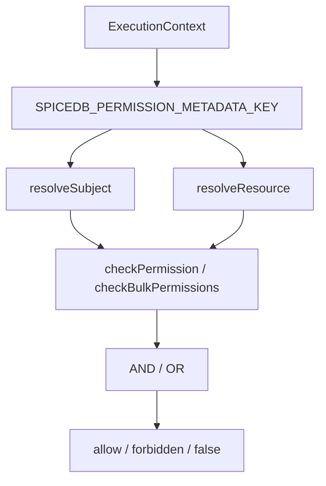

# spicedb-toolkit 包说明

## 1. 依据代码清单

- `packages/spicedb-toolkit/core/src/public-api.ts`
- `packages/spicedb-toolkit/core/src/client/index.ts`
- `packages/spicedb-toolkit/core/src/permission/index.ts`
- `packages/spicedb-toolkit/core/src/relationship/index.ts`
- `packages/spicedb-toolkit/core/src/schema/index.ts`
- `packages/spicedb-toolkit/core/src/common/tracing.ts`
- `packages/spicedb-toolkit/nestjs/src/module.ts`
- `packages/spicedb-toolkit/nestjs/src/service.ts`
- `packages/spicedb-toolkit/nestjs/src/guard.ts`
- `packages/spicedb-toolkit/nestjs/src/decorators.ts`
- `packages/spicedb-toolkit/cli/src/run.ts`

## 2. 一句话总览

`@spicedb-toolkit/core` 封装 SpiceDB client、permission、relationship、schema 和 tracing；`@spicedb-toolkit/nestjs` 把 core toolkit 接入 Nest DI、装饰器和 Guard；CLI 包提供命令行入口。

## 3. core facade

`createSpiceDbToolkit(config)` 返回：

| 字段 | 能力 |
| --- | --- |
| `client` | SpiceDB gRPC client。 |
| `permission` | check、bulk check、lookup resources、lookup subjects。 |
| `relationship` | write、touch、read、delete relationships。 |
| `schema` | parse、analyze、read、write、diff schema。 |

core 包同时导出：

- `defineConfig()`、`validateConfig()`、`loadConfig()`。
- consistency helper：`fullyConsistent()`、`atLeastAsFresh()`、`atExactSnapshot()`、`minimizeLatency()`。
- tracing helper：`traceSpiceDbRpc()`、`startSpiceDbOperationTrace()`、`finishSpiceDbOperationTrace()` 等。
- error helper：`SpiceDbToolkitError`、`wrapGrpcError()`、`isPermissionDenied()`、`isUnavailable()`。

## 4. NestJS 集成

`SpiceDbModule.forRootAsync()` 在应用侧注册：

- `SpiceDbService`：延迟初始化 toolkit，暴露 permission、relationship 和 schema 方法。
- `SpiceDbGuard`：读取 `@SpiceDbPermission()` metadata 并调用 `SpiceDbService`。
- module options：支持直接 config、config file 或已有 client。

`SpiceDbGuard` 的解析顺序：

1. `@SpiceDbPermission()` metadata 中的 subject。
2. handler 级 `@SpiceDbResolvers()`。
3. class 级 `@SpiceDbResolvers()`。
4. module options 的全局 resolver。

resource 解析同样优先使用 metadata 中的 `resourceType/resourceId`，再使用 method/class/global resolver。

## 5. Guard 行为

规则：

- 没有 `@SpiceDbPermission()` 的 handler 不做 SpiceDB 限制。
- subject 或 resource 解析失败时返回 Forbidden。
- 单 permission 走 `checkPermission()`，多 permission 走 `checkBulkPermissions()`。
- `mode` 默认为 `AND`，也支持 `OR`。
- `defaultGuardBehavior` 为 `throw` 时拒绝会抛 Forbidden；其他配置返回 `false`。

## 6. 项目内使用边界

- admin-api 和 app-api 通过 `createSpiceDbNestOptions()` 传入 Better Auth session subject resolver。
- RBAC 基础授权不读取 SpiceDB metadata。
- SpiceDB 路由级授权必须显式声明 resource、permission 和 resolver。
- `AdminSpiceDbAuthorizationService` 是项目内业务关系读写封装，底层调用 toolkit service/client 能力。

## 7. 回归检查

- config、config file、client 三种初始化路径至少有一个可用。
- `@SpiceDbPermission()` 单权限和多权限检查能返回正确结果。
- method resolver 优先于 class resolver，class resolver 优先于全局 resolver。
- schema read/write、relationship read/write/delete 和 permission lookup 保持 tracing payload。
